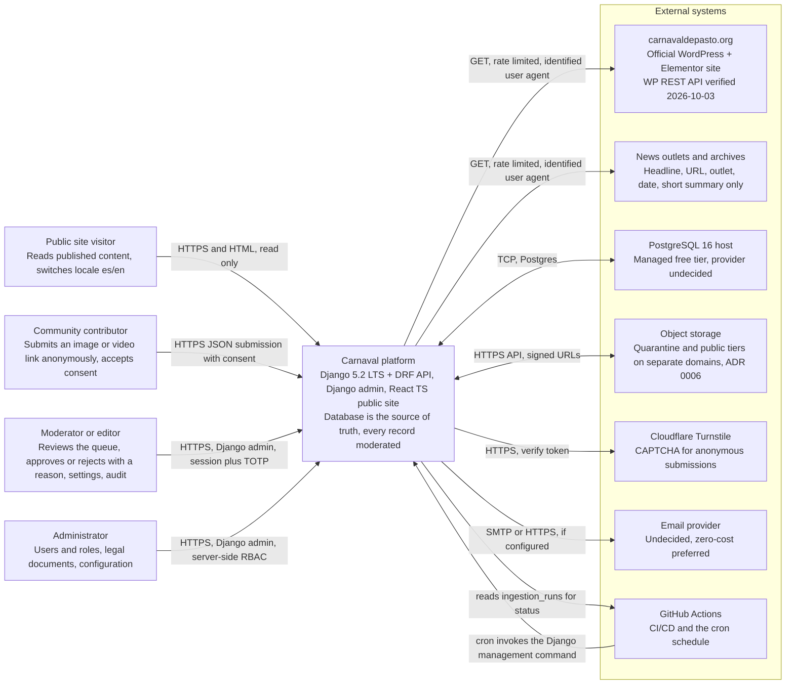
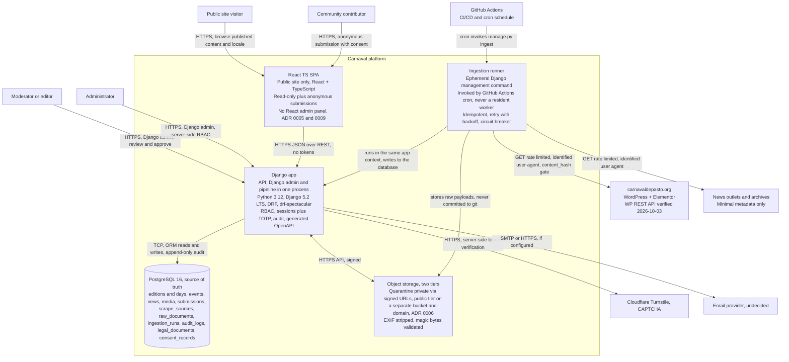

# C4 Architecture

- **Status:** Draft for review
- **Date:** 2026-10-03
- **Relates to:** ADR 0002 (scraper optional; database as source of truth), ADR 0003 (monorepo), ADR 0005 (Django admin; sessions + TOTP; no JWT), ADR 0006 (two storage tiers: quarantine and public), ADR 0009 (Python 3.12/Django 5.2 LTS/DRF, PostgreSQL 16, React TS public only), ADR 0010 (bilingual), ADR 0011 (generated OpenAPI, drift-checked in CI), brief §7 (architecture), §9 (security), §10 (submissions).

> The backend language and stack are **decided** by ADR 0009. The brief §6/§9/§12 describing JWT and an undecided stack are **superseded** (see `docs/00-acta-proyecto.md` §9).

## 1. Level 1 — System Context

The system is the “Carnaval de Negros y Blancos” web platform. It ingests, moderates, and exposes programme and editorial content with attribution. Scraping is **optional** (ADR 0002).

**Actors**
- Public site visitor (reader): reads published content, switches locale (es/en), searches.
- Community contributor: submits anonymous image or video link, accepts terms and consent (v3).
- Moderator/editor (maintainer): reviews queue, approves/rejects with reason, manages settings, audit log.
- Administrator (maintainer role): manages users/roles, legal documents, configuration (RBAC, server-side).

**External systems**
- `carnavaldepasto.org` (official WordPress site) — ingestion source; the **WP REST API responds and was verified on 2026-10-03** (`docs/fuentes-y-atribucion.md` §9), so it is the preferred interface over HTML parsing (FR-B-15).
- News outlets/archives — ingestion sources (headline/link/summary only; no full articles committed).
- PostgreSQL host — managed PostgreSQL 16 instance (free tier; provider **undecided**).
- Object storage — quarantine and public tiers as separate buckets (two-tier storage per ADR 0006; provider/domain separation; R2 has no egress fees — **decisive**, provider **undecided**).
- Cloudflare Turnstile — CAPTCHA for anonymous submissions.
- Email provider — for takedown responses/notifications as needed (**undecided**, zero-cost preferred).
- GitHub Actions — scheduling (cron) and CI/CD; runs ingestion via Django management command.

**Diagram (Level 1 — system context)**

Rendered as a Mermaid `flowchart`, **not** PlantUML C4: this repository publishes
its diagrams on GitHub, which understands Mermaid and does not render PlantUML.
The layout is a simplification of C4's System Context level and is labelled that
way instead of being presented as output from a C4 tool (ADR 0014).

## 2. Level 2 — Container diagram

Containers are the deployable/runnable units (per ADR 0009 and constraints). The public site availability **does not depend** on any external source; the scraper is **optional** (ADR 0002).

**Containers**
- `django_app` (process): Django 5.2 LTS + DRF. Serves public read API, submission endpoints (v3), Django admin surface (same process), moderation logic, ingestion pipeline (`ingestion` management command), RBAC/server-side session auth, audit logging. **Technology:** Python 3.12. **Deployment:** application host (free tier, **undecided**).
- `django_admin` (surface): Django admin UI exposed by the same `django_app` process (separate surface). RBAC enforced server-side; sessions + TOTP; **no JWT**. **Deployment:** same host.
- `spa_public` (static assets): React + TypeScript **public site only**. Read-only plus anonymous submissions; **no React admin panel** (ADR 0005/0009). **Deployment:** static host/CDN (free tier, **undecided**; can be separate from API).
- `postgres` (data): PostgreSQL 16. Source of truth. **Deployment:** managed DB (free tier, **undecided**: Supabase/Neon or other zero-cost; verify limits).
- `object_storage` (buckets): Two-tier object storage: `quarantine` (private, access via signed URLs, server-side only) and `public` (readable by public where appropriate). Separate buckets and preferably separate domain (ADR 0006). **R2 has no egress fees** — **decisive** for image-heavy site; provider **undecided**.
- `ingestion_runner` (ephemeral): Django management command invoked by **GitHub Actions cron** — **NOT a resident worker** (fits zero-cost constraint C1). Runs idempotently (gate on `raw_documents.content_hash`), retry with backoff, circuit breaker after N consecutive failures; marks source disabled on failure. **Technology:** Python (same code). **Deployment:** GitHub Actions workflow (free tier).

**Relationships**
- SPA -> Django app: HTTPS/REST (public read, anonymous submissions, locale). Uses session cookies for CSRF where applicable; no tokens.
- Browser -> Django admin: HTTPS (session + TOTP). Server-side RBAC on every request.
- Django app -> Postgres: TCP (ORM). Append-only audit; moderation state transitions recorded.
- Django app -> Object storage: HTTPS/API (signed uploads/downloads). Quarantine private; move to public on approval. EXIF stripped, magic-bytes validated.
- Ingestion runner (GA) -> Django app codebase via checkout; executes `manage.py <ingest>` against configured sources: HTTPS GET to external sources (rate-limited, identifiable User-Agent). Writes to Postgres (`raw_documents`, `ingestion_runs`, proposed pending records). Does **not** delete published data if sources fail.
- CAPTCHA verification: SPA/submission -> Turnstile (browser) + server-side verify via Django app.
- Email: Django app -> email provider (SMTP/HTTPS) if configured.

**Diagram (Level 2 — containers)**

Same conversion as above: Mermaid `flowchart` with a `subgraph` standing in for
C4's `System_Boundary`, honestly labelled rather than presented as C4 output
(ADR 0014).

