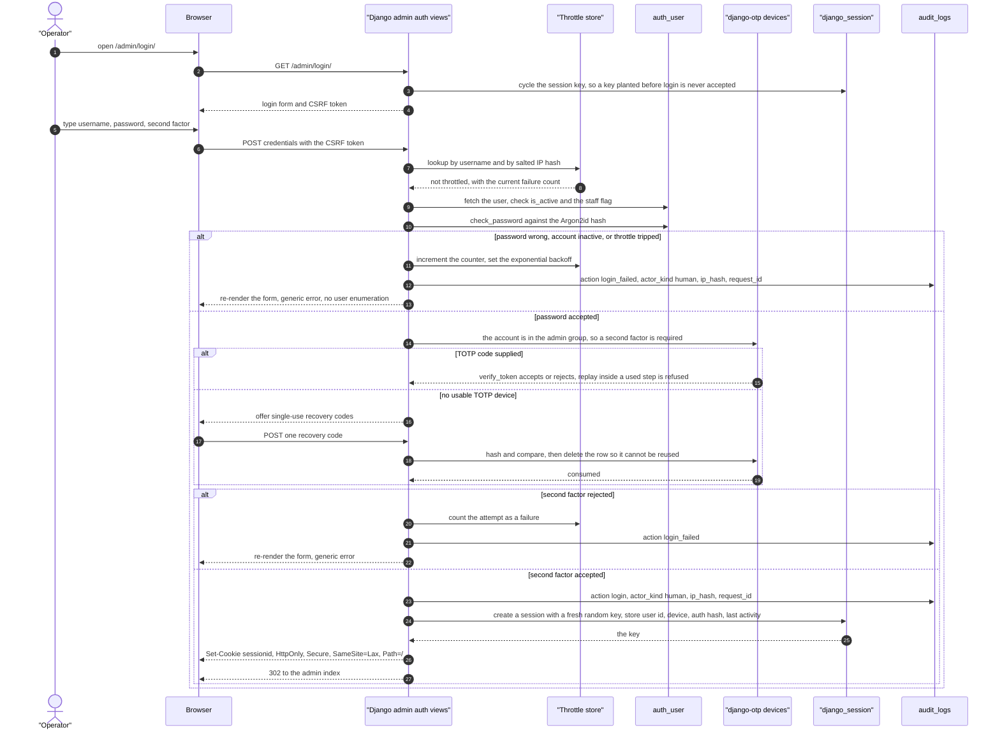
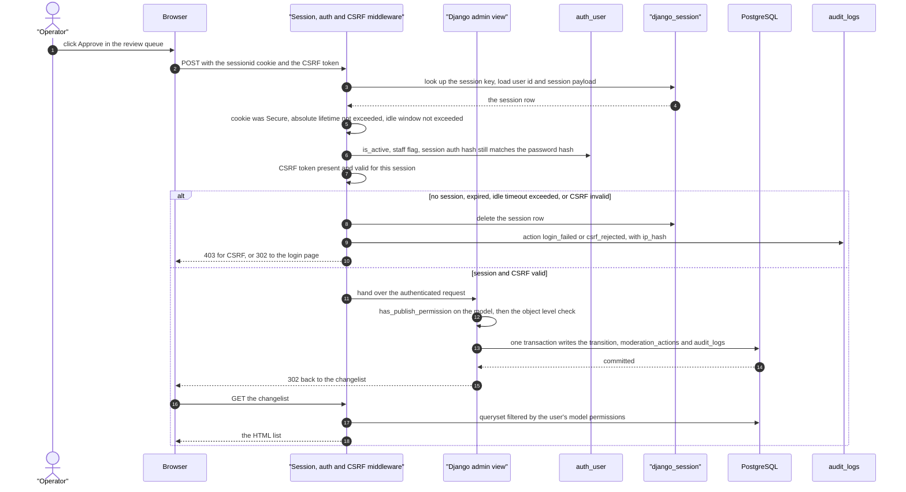
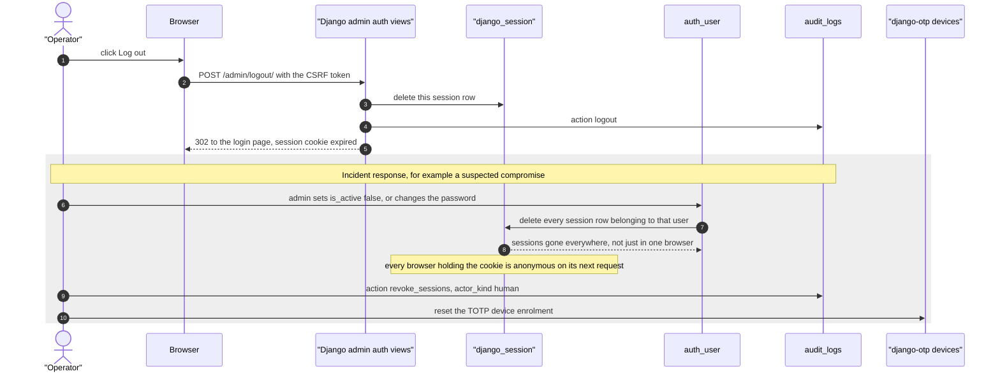
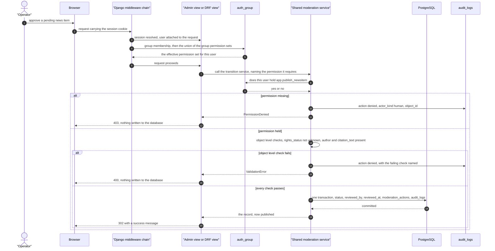

# Authentication and authorization flows

- **Status:** Draft for review
- **Date:** 2026-10-03
- **Relates to:** ADR 0005 (Django sessions with TOTP, not JWT) — this document describes
  that decision operationally and **supersedes the brief's JWT plan**; brief §6 decisions 7
  and 8, §8 (`users`, `roles`, `refresh_tokens`), §9 (admin security), §10 (anonymous
  submissions); ADR 0006, ADR 0009 (stack), ADR 0010 (admin is Spanish only);
  `docs/02-diseno/modelo-datos.md` §5; `docs/02-diseno/roles-permisos.md`;
  requirements SRS §3.4 (`FR-D-*`, `SRS SEC-01 … SEC-15`), cases
  `docs/03-pruebas/casos-seguridad.md` §A–§B
- **Implementation:** Django 5 built-in auth, `django-argon2`, `django-otp`, server-side
  sessions in PostgreSQL 16, `django-admin-log` plus `audit_logs`

## 1. Scope, and the deviation from the brief

The brief was written before a framework was chosen and specified short-lived access tokens
plus rotating refresh tokens in `httpOnly` cookies for a React admin panel. ADR 0009 chose
Django, whose admin authenticates with server-side sessions, and ADR 0005 replaced the token
plan. Section 8 below maps every brief §9 requirement to its resolution, including the three
that were dropped.

The **intent** behind the brief's decision is the requirement that survives (ADR 0005):
*a stolen browser session must not hand an attacker a long-lived, ungovernable
credential.* Sessions satisfy that more strongly than tokens did, because no bearer
credential exists in the browser at all.

## 2. Login

Points that are decisions rather than mechanics:

- The session key is **cycled at login**, so a session identifier planted before
  authentication is never the one that becomes authenticated (SEC-10 test case).
- **No user enumeration**: one generic error for a wrong password, an inactive account and a
  wrong second factor, and the response shape is identical (SEC-08 test case).
- **Every** attempt writes `audit_logs` — `login` on success, `login_failed` on failure —
  with `ip_hash` set (FR-D-10, FR-D-08). The IP is a SHA-256 salted with a server secret,
  never the address itself (`modelo-datos.md` §8; PRV-01, PRV-02).
- TOTP is required for accounts in the `admin` group (SRS SEC-04). `editor` and `viewer`
  accounts may enrol optionally; brief §9 requires MFA for administrators and no more.

## 3. An authenticated request

The absolute and idle lifetimes in the third step are **undecided** — see §5.3.

## 4. Logout, and central revocation

Revocation by `is_active = false` or by a password change is also automatic: Django stores a
session auth hash derived from the password and re-checks it on every request, so changing
the password invalidates every session without touching the session table. The explicit
`DELETE` is still the reliable mechanism, because it also covers a session that has not yet
been re-validated and a stolen cookie used from a new IP.

## 5. RBAC enforcement

Three properties hold regardless of which surface the request arrived on:

- **Authorization is evaluated server-side on every request** (FR-D-04). There is no
  client-side decision to subvert, and no cached "is this user an editor" flag in the browser.
- **The check names a permission, and the write happens in one place.** All moderation
  transitions go through a single service, so the permission check and the write cannot be
  separated by a future code path. Authorization is checked at the **object** level, not only
  on the list (SRS SEC-09), and a record the operator is not assigned to is refused by URL as
  well as in the changelist (SRS SEC-10; SEC-14 test case).
- **Hiding a control in the admin interface is never the control.** A button that is not
  rendered for a `viewer` is a courtesy; the `403` above is the enforcement. The same applies
  to the DRF permission class used by the public endpoints.

The permission model itself is in `docs/02-diseno/roles-permisos.md`; the SEC-13 test case
enumerates it cell by cell, so a role gaining a capability without a matrix change fails the
suite.

## 6. The three roles

Django auth groups `admin`, `editor`, `viewer` (FR-D-02), seeded deterministically by a data
migration so the permission set is reproducible and reviewable rather than hand-clicked.

| Role | May | Must not |
|---|---|---|
| `admin` | Everything: approve, reject, unpublish, edit `site_settings`, manage `scrape_sources`, trigger an ingestion run, manage `legal_documents` versions, manage users and groups, answer takedown requests, purge rejected uploads | Modify or delete an `audit_logs` entry; bypass the rights gate; disable the audit trail |
| `editor` | Review and moderate content: view pending items, approve, reject with a reason, unpublish, edit content fields, view sources and run history | Change site configuration, manage scrape sources, trigger a run, edit legal documents, manage users or roles, respond to a takedown, purge uploads |
| `viewer` | Read-only: view the admin, view pending items, view ingestion runs and audit read-only history | Transition moderation state in any direction; edit any field; manage anything; download raw payloads |

Brief §9 requires least privilege, verified server-side (FR-D-04 … FR-D-07; `viewer` may
never transition state, FR-D-05). Full matrix in `docs/02-diseno/roles-permisos.md`.

## 7. Session mechanics

### 7.1 Where the session lives

Server-side, in PostgreSQL, via `django.contrib.sessions.backends.db` (SRS SEC-02). **The
browser holds only a session key.** Nothing about the user, the groups, or the granted
permissions is in the cookie.

> **Table name:** `django_session`, which is Django's real table. An earlier draft of
> `modelo-datos.md` §5 and of the security register called it `auth_session`; that was a
> defect and has been corrected in all three documents, so no second wrong name survives.

### 7.2 Cookie contents and flags

SRS SEC-02 requires exactly these four properties; SEC-03 asserts each one.

| Attribute | Value | Reason |
|---|---|---|
| Name | `sessionid` | Django default; no name collision with the public site |
| Value | 32-character random alphanumeric key | Opaque; carries no claims and cannot be decoded |
| `HttpOnly` | yes | JavaScript cannot read it, so XSS cannot exfiltrate a usable credential |
| `Secure` | yes | Never sent over plain HTTP |
| `SameSite` | `Lax` | Blocks cross-site form posts from carrying the cookie |
| `Path` | `/` | |
| `Domain` | unset (host-only) | Not shared with the public site or any sibling subdomain |
| `Expires` / `Max-Age` | matches the absolute lifetime | The cookie stops being sent when the session is dead |

Cookie-only: no `localStorage`, no `sessionStorage`, no JavaScript-readable copy. React never
touches authentication at all — it only reads the public API and posts anonymous submissions
(ADR 0009).

### 7.3 Timeouts — **undecided**

SRS §9.2 lists these as an open question and proposes **8 h idle, 24 h absolute**. Those are
the defaults below; they are not decided, and they must be set deliberately rather than left
at Django's defaults, which are longer.

| Limit | Proposed default (SRS §9.2) | Notes |
|---|---|---|
| Idle timeout | 8 hours | **Not provided by Django.** `SESSION_SAVE_EVERY_REQUEST = true` slides `expire_date` forward on every request, which is a *sliding absolute* limit, not an idle limit. A true idle timeout needs `last_activity` in the session payload and a small middleware that expires the session once it is older than the window. |
| Absolute timeout | 24 hours | `SESSION_COOKIE_AGE`. Irrefuseable: even a perfectly active session dies, which bounds the value of a stolen cookie. |
| Close the browser | session ends | `SESSION_EXPIRE_AT_BROWSER_CLOSE = true`, so a forgotten tab on a shared machine is not an open session. **Undecided** — it also forces a re-entry of the TOTP code. |

Expired rows are removed by `manage.py clearsessions`, run from the same scheduled workflow
as ingestion (`docs/02-diseno/flujo-datos.md` §8).

### 7.4 Concurrent sessions — **undecided**

**Proposed default: one active session per user.** A new login deletes the account's other
sessions and writes `audit_logs` `session_replaced`. Rationale: there is exactly one operator,
so a second session is more likely to be an attacker than a second device — and it is exactly
the situation the incident-response requirement needs to handle. The alternative, allowing a
fixed number of sessions and showing them in the admin, is defensible and is the right answer
if a second operator is ever added.

Django's `is_staff` also matters here: a non-staff authenticated user cannot reach `/admin/`
at all, which is the first gate rather than the authorisation decision.

### 7.5 Central revocation, and why it beats refresh rotation

| Property | This design | The brief's JWT plan |
|---|---|---|
| Revoke one account everywhere | One indexed `DELETE` on the user's session rows; immediate | Per-token; global revocation needs a denylist or a version claim, which is state the JWT design was meant to avoid |
| Revoke one session | Delete that row | Revoke that refresh token; access tokens stay valid until they expire |
| Kill an active session in flight | Yes | No — a short-lived access token remains good until expiry |
| Response to a suspected compromise | Change the password, or set `is_active = false`; done | Rotate the refresh token and hope no access token is still live |
| Audit trail of revocation | `audit_logs`, plus the row deletion itself | Requires a server-side denylist to be meaningful |

This is the concrete sense in which sessions are **strictly better than refresh rotation**
for this project (ADR 0005; SRS SEC-08): revocation is a first-class, immediate operation
instead of a best-effort one. The property the brief was reaching for — a stolen browser
session must not be a long-lived ungovernable credential — is satisfied by the absolute timeout
and by the fact that the cookie is revocable at all.

## 8. No JWT

### 8.1 What was dropped

| Dropped | Consequence |
|---|---|
| Access token with a 10–15 minute lifetime (SRS SEC-03) | Nothing to expire |
| Refresh token with rotation (SRS SEC-03) | No rotation races, no reuse detection, no refresh endpoint |
| Hashed refresh token store | **There is no `refresh_tokens` table.** The brief lists one in §8; ADR 0005 removes it and `modelo-datos.md` §5 records the removal |
| `Authorization: Bearer` on any request | No bearer credential exists anywhere (SEC-02 test case) |
| Signing key distribution to the client | The client never verifies anything, so there is no algorithm-confusion or `alg=none` surface |
| Client-side expiry handling, clock-skew tolerance | No client clock is trusted or needed |

Reintroducing any row above is a deviation from ADR 0005 and needs a new ADR, not a code
change.

### 8.2 What is kept or strengthened

Argon2id password hashing, TOTP MFA for administrators, cookies that are `httpOnly`, `Secure`
and `SameSite`, CSRF protection, server-side RBAC on every request, login throttling with
temporary lockout, audit of every approval, rejection and configuration change, no public
admin sign-up, secrets only in environment variables.

The cookie flag requirement is satisfied **more strongly**: a session cookie contains no token
at all, only an opaque key that is meaningful to one server.

### 8.3 Brief §9 requirement → resolution

| Brief §9 requirement | Resolution | Mechanism | Requirement |
|---|---|---|---|
| Argon2id passwords | Kept | `django-argon2`, first hasher in `PASSWORD_HASHERS` | SEC-01, SEC-02 test case |
| Access token of 10–15 min | **Dropped** | No token is issued, so none can leak | SRS SEC-03 |
| Refresh token with rotation, stored hashed to allow revocation | **Dropped** — central session revocation is strictly better | `DELETE` on the user's session rows | SRS SEC-08, FR-D-10 |
| Tokens in `httpOnly`, `Secure`, `SameSite` cookies, never `localStorage` | Kept and strengthened | The cookie carries only an opaque session key; there is no token to place in `localStorage` | SRS SEC-02, SEC-03 |
| CSRF protection | Kept | Django CSRF middleware on every mutating request, plus `SameSite=Lax` as defence in depth | SRS SEC-07 |
| TOTP MFA for administrators | Kept | `django-otp`, required for the `admin` group | SRS SEC-04, SEC-05; FR-D-02 |
| RBAC with least privilege, always verified server-side | Kept | Django model permissions plus object-level checks; admin UI hiding is never the control | FR-D-04 … FR-D-07; SRS SEC-09, SEC-10 |
| No public admin registration, first admin from a seed script | Kept | §12 below | FR-D-13, FR-D-14 |
| Login attempt limits and temporary lockout | Kept | §10.1 below | SRS SEC-06 |
| Audit log of every approval, rejection and configuration change | Kept | `audit_logs`, written from Django signals and explicit calls | FR-D-08, FR-D-09, FR-D-10 |
| Strict input validation, restricted CORS, security headers (CSP, HSTS), HTTPS always, secrets only in environment variables | Kept | Settings in §11; header and CORS detail belongs to the threat model | NFR-07, NFR-08, NFR-09; SRS SEC-15 |
| Dependency scanning | Kept | Dependabot, enabled with the repository | NFR-10; SRS SEC-16 |
| STRIDE threat model documented in `docs/02-diseno/` | Kept | `docs/02-diseno/modelo-amenazas.md` | — (documentation obligation, no testable ID) |

The brief's §9 list is reproduced in full above — nothing is omitted. One item is replaced
rather than kept or dropped: the brief's refresh-token store existed to make revocation
possible, and §7.5 shows sessions already provide it, so the table is gone while the property
stays. Brief §8's `refresh_tokens` table is removed for the same reason (§8.1).

Brief §9 also names `OWASP Top 10 and ASVS` as references and requires a STRIDE threat model
in `docs/02-diseno/`; the latter is satisfied by `modelo-amenazas.md`.

### 8.4 The security property this buys

1. **No bearer credential in the browser.** A JWT is self-contained and self-verifying: once
   stolen, it is valid until it expires, and any client that attaches it must be able to
   read it — which is why `localStorage` tokens are exfiltratable by any XSS. A session
   cookie is an opaque random key, unreadable by JavaScript, and its only power is whatever
   the server currently says that key maps to.
2. **It is revocable.** Deleting a row ends the credential. That single operation is what the
   brief's hashed refresh token store existed to approximate.
3. **Authorisation state cannot go stale in the client.** Group membership, permissions and
   TOTP enrolment are read from the database on every request, so revoking a privilege takes
   effect at once.
4. **The cost is one indexed read per authenticated admin request**, which is irrelevant at
   this scale and is recorded as an accepted negative in ADR 0005. Sessions are not
   stateless; a future third-party or mobile client would need a token scheme designed at
   that point, not carried speculatively now.

## 9. MFA

- **TOTP via `django-otp`**, required for accounts in the `admin` group (SRS SEC-04), optional
  for the others. Devices are `otp_totpdevice` rows with `confirmed`. Brief §9 requires MFA for
  administrators and no more, so `editor` and `viewer` are not forced (FR-D-02 defines the
  three groups; FR-H-08 makes the console Spanish-only, which is why no MFA localisation
  surface exists).
- Enrolment happens on first login for an admin account and is **forced**: the admin cannot
  reach any admin view until a device is confirmed. Recovery codes are generated at that
  moment.
- **Recovery codes are single-use and hashed at rest** (SRS SEC-05). They are `otp_staticdevice`
  / `otp_statictoken` records; django-otp stores the code as a hash in `token_hash`, never in
  cleartext, and the row is deleted the moment the code is consumed. They are shown once and
  are stored offline by the operator. **Undecided:** how many codes (proposed 10) and their
  storage guidance for the maintainer, which belongs in `docs/CONTRIBUTING.md` or
  `SECURITY.md`.
- Verification rejects a code outside the tolerance window and refuses to accept a code from
  a step counter already used, so a shoulder-surfed code cannot be replayed inside its
  window (SEC-06 test case).
- Deleting the last TOTP device of the last active `admin` account is blocked in the admin
  hooks, because locking the sole operator out of their own site is a real operational risk.

## 10. Login throttling and authentication audit

### 10.1 Throttling

- **Lockout after N consecutive failures, with exponential backoff** (SRS SEC-06). **Undecided
  values:** proposed `N = 5` consecutive failures, exponential delay `2^(failures - 2)` seconds
  capped at 15 minutes, counters reset on success.
- Counters are keyed by **username and by salted IP hash**, both, so neither a targeted
  account nor a single host is sufficient on its own.
- **Counter storage must not create a raw-IP database.** An unsalted IPv4 hash is trivially
  reversible over 2³² candidates, so the key is `SHA-256(ip + server secret)` — the same
  treatment as `ip_hash` in `modelo-datos.md` §8. Store is Django's cache framework with a
  **database-backed cache**, so counters are shared across processes and survive a restart,
  and no extra paid service is required.
- **A lockout must not become a denial-of-service against the sole operator.** Anyone who
  knows the admin's username can burn the failure budget. Mitigations: the window is short,
  counters are salted-hashed so they cannot be enumerated, the operator has shell access to
  the deployment and can clear counters with `manage.py unlock_account`, and an application
  error that locks the admin out is logged to `audit_logs` as such.
- **Undecided: implementation.** A vetted third-party package such as `django-axes` is
  preferable to hand-rolled logic, but only if its storage can be configured to keep hashed
  addresses. Otherwise a small middleware over the database-backed cache is acceptable: this
  is rate limiting, not cryptography, and it touches no secret.

### 10.2 Audit

Both outcomes are recorded, not just the successful one (FR-D-10, SEC-18):

| Event | `action` | `actor` | `actor_kind` | Other fields |
|---|---|---|---|---|
| Successful login | `login` | the user | `human` | `ip_hash`, `request_id` |
| Rejected login | `login_failed` | null, or the user if it exists | `human` | `ip_hash`, `request_id`, reason in `changes` |
| Logout | `logout` | the user | `human` | `ip_hash` |
| Central revocation | `revoke_sessions` | the revoking admin | `human` | the revoked user in `object_id` |
| TOTP enrolment or removal | `mfa_change` | the user | `human` | `ip_hash` |

`ip_hash` is never a raw address — PRV-01 and PRV-02, and SEC-18 additionally asserts that
two addresses do not collide, the same address yields a stable hash, and **no raw address
appears anywhere, including inside `last_error` text and application logs** (NFR-19).
`django_admin_log` also records Django's own admin events, but `audit_logs` is the
authoritative trail: it covers pipeline actions and logins, which `django_admin_log` does not
(`modelo-datos.md` §5.1). `audit_logs` is append-only — no role, including `admin`, can
update or delete it (FR-D-09, SEC-16).

### 10.3 Where this document is verified

Every mechanism above has an executable case in `docs/03-pruebas/casos-seguridad.md`. The IDs
below are **case IDs from that register**, which are numbered independently of the SRS
`SEC-nn` requirement IDs cited elsewhere in this document; each case header names the SRS
requirements it maps to.

| Case | Covers | Section here |
|---|---|---|
| SEC-01 | Argon2id hash, no cleartext password | §9, §11 |
| SEC-02 | No bearer token anywhere, `document.cookie` cannot read the session cookie | §8 |
| SEC-03 | `HttpOnly`, `Secure`, `SameSite=Lax`, `Path=/` | §7.2 |
| SEC-04 | TOTP mandatory for the administrator role | §2, §9 |
| SEC-05 | Recovery codes hashed and single-use | §9 |
| SEC-06 | A replayed TOTP code is refused | §2, §9 |
| SEC-07 | Lockout, exponential backoff, no user enumeration by timing | §2, §10.1 |
| SEC-08 | No user enumeration in the response | §2 |
| SEC-09 | CSRF on every mutating endpoint, including bulk actions | §11 |
| SEC-10 | The session key rotates on login | §2 |
| SEC-11 | Central revocation is immediate and total | §4, §7.5 |
| SEC-12 | No public signup path | §12 |
| SEC-13 | The role matrix is enforced cell by cell | `roles-permisos.md` §3 |
| SEC-14 | Authorization is object-level, not list-level | §5 |
| SEC-15 | Anonymous callers reach no authenticated endpoint | §13 |
| SEC-16 | `audit_logs` is append-only, including for `admin` | §10.2 |
| SEC-17 | Every moderation action is recorded | §5 |
| SEC-18 | Both login outcomes audited with a salted IP hash | §10.2 |
| SEC-27 | CAPTCHA and honeypot resist automation | §13 |
| SEC-32 | No raw IP anywhere, including in logs | §10.2, §10.1 |
| SEC-43 | Security headers on every response, including error responses | §11 |
| SEC-44 | CORS restricted to our own origins | §11 |
| SEC-46 | No secrets in the repository; settings fail loudly when a variable is absent | §11, §12 |
| SEC-47 | The public API exposes published content only | §13 |
| SEC-50 | `audit_logs` rows cannot be updated or deleted, even by `admin` | §10.2 |
| SEC-51 | `request_id` correlates every row one request produces | §10.2 |
| SEC-52 | No secret-shaped values recorded in audit `changes` | §10.2 |
| SEC-54 | Audit rows are written only by application code; text is escaped | §10.2 |

The register also holds SEC-19 … SEC-26, SEC-28 … SEC-31, SEC-33, SEC-34, SEC-35 … SEC-42,
SEC-45, and SEC-48, SEC-49, SEC-53, SEC-55 … SEC-74, which cover other parts of the design
and are mapped in the coverage audit at the end of that file.

Throttling, TOTP verification and cookie issuance are unit-tested with mocked time and
mocked HTTP; no case contacts a live service (`docs/03-pruebas/plan-pruebas.md` §1).

## 11. CSRF

- Django's CSRF middleware is on by default and covers **every mutating request** — POST,
  PUT, PATCH, DELETE. It is not switched off anywhere for convenience (SRS SEC-07; SEC-09
  test case, which includes Django admin bulk actions).
- **The session cookie is `SameSite=Lax`**, which already prevents a cross-site form post
  from carrying the credential. This is defence in depth behind the token check, not a
  replacement for it.
- The CSRF token is stored in the session, not in a second cookie
  (`CSRF_USE_SESSIONS = true`), so there is one fewer cookie for an attacker to try to read,
  and the token cannot leak through a cookie-injection vector.
- `CSRF_COOKIE_SECURE = true` and `CSRF_COOKIE_HTTPONLY = true`, since the React public site
  never needs to read it.
- HTTPS everywhere: `SECURE_SSL_REDIRECT`, HSTS, and `SECURE_PROXY_SSL_HEADER` for the
  reverse proxy (NFR-07). Reference: OWASP ASVS, cited by brief §9.

| Setting | Value | Status |
|---|---|---|
| `PASSWORD_HASHERS` | Argon2id first | Decided, ADR 0005 |
| `SESSION_ENGINE` | `django.contrib.sessions.backends.db` | Decided, ADR 0005 |
| `SESSION_COOKIE_NAME` | `sessionid` | Decided |
| `SESSION_COOKIE_HTTPONLY` / `_SECURE` / `_SAMESITE` | `true` / `true` / `Lax` | Decided, ADR 0005 |
| `SESSION_COOKIE_DOMAIN` | unset | Decided |
| `SESSION_COOKIE_AGE` | 24 hours | **undecided**, SRS §9.2 item 2 |
| `SESSION_EXPIRE_AT_BROWSER_CLOSE` | `true` | **undecided** |
| `SESSION_SAVE_EVERY_REQUEST` | `true` | **undecided**, and the idle timeout needs the middleware in §7.3 |
| `CSRF_USE_SESSIONS` | `true` | **undecided** |
| `CSRF_COOKIE_SECURE` / `_HTTPONLY` | `true` / `true` | **undecided** |
| `SECURE_SSL_REDIRECT`, `SECURE_HSTS_SECONDS`, `SECURE_CONTENT_TYPE_NOSNIFF` | on | **undecided** — NFR-07 and SRS SEC-15; header policy belongs to the threat model |
| `CORS_ALLOWED_ORIGINS` | the site's own origins, no wildcard | **undecided** — NFR-08; SEC-44 test case |
| `X_FRAME_OPTIONS` / `Referrer-Policy` | deny / strict-origin-when-cross-origin | **undecided** — NFR-07; SEC-43 test case |
| Secrets | environment variables only, never `site_settings` | Decided, NFR-09, SEC-46 |

The admin surface also needs `X-Robots-Tag: noindex` and a `robots.txt` disallow (NFR-21), and
its logs must never contain session identifiers (NFR-19).

## 12. Account provisioning

- **No public sign-up** (FR-D-13). There is no registration endpoint, no invitation flow, and
  no third-party login. The public API exposes no user surface at all (§13), and SEC-12 asserts
  the absence by enumerating routes rather than by reading this document.
- The first administrator is created by a **documented seed management command, never through
  the API** (FR-D-14; brief §9 "el primer admin se crea con un script de siembra"). All accounts
  are created by such commands, run from a shell the operator already holds:

  | Command | Purpose | **undecided name** |
  |---|---|---|
  | `manage.py seed_roles` | Create the `admin`, `editor` and `viewer` groups (FR-D-02) and assign permissions deterministically, so the permission set is a migration rather than a manual act | `seed_roles` |
  | `manage.py seed_admin` | Create the first administrator, add it to the `admin` group, force TOTP enrolment at first login, prompt for the password, write `audit_logs` with `actor_kind = system` (FR-D-14) | `seed_admin` |
  | `manage.py create_staff --group editor` | Add an `editor` or `viewer` | `create_staff` |
  | `manage.py unlock_account` | Clear throttle counters after a self-lockout (§10.1) | `unlock_account` |

  A superuser is **not** created here. `is_superuser` bypasses the permission matrix, which
  would leave a role outside `docs/02-diseno/roles-permisos.md` and outside the SEC-13
  enumeration; the seeded account is a staff user in the `admin` group instead.
- No password is ever stored in the repository or passed as a command-line argument (NFR-09,
  SEC-46); it is prompted for interactively or read once from the environment on first
  bootstrap.
- `UserAdmin.has_add_permission` is restricted to holders of `auth.add_user`, and an admin
  cannot edit their own row through the interface, so nobody can quietly escalate themselves
  or lock themselves out (FR-D-07, SRS SEC-10).
- Group membership changes are audited (FR-D-08, SEC-17 test case).

## 13. The public side: no accounts at all

**Anonymous read.** The public API is `AllowAny` and its queryset is filtered to
`status = 'published'` (FR-A-06). No session is issued, no cookie is set, and no authentication
class is even active on those views. The read surface is editions, days, events and venues
(FR-A-07); SEC-47 asserts that no `pending` or `rejected` record is reachable, including by
direct URL.

**Anonymous submission** (v3). The only write a visitor can perform is a public submission,
authenticated **not** by an account but by:

| Control | Purpose | Requirement |
|---|---|---|
| CAPTCHA, proposed Cloudflare Turnstile | Stops scripted bulk submission | FR-F-17, SRS SEC-14 |
| Rate limit per salted-IP-hash and a global daily pending quota | Bounds storage abuse on a free tier (brief §14, NFR-17) | FR-F-12, FR-F-16 |
| Honeypot field | Cheap filter for naive bots | FR-F-17, SRS SEC-14 |
| Magic-byte allowlist, re-encode, EXIF and GPS stripping | The file is treated as hostile input (ADR 0006) | FR-F-03 … FR-F-07; SRS SEC-11, PRV-04 |
| Blocking, unchecked terms acceptance recorded in `consent_records` | The exact legal version accepted is provable (brief §10) | FR-F-10, FR-F-11, PRV-05 |
| Status lookup by unguessable `public_token` | The contributor can follow their submission without an account and without enumeration | FR-F-18, SRS SEC-27 |

**There are no user accounts on the public site, and none are planned** — public accounts are
explicitly out of scope (brief §4, SRS §8). NFR-18 states the rule in one line: the public API
is read-only for anonymous callers, and submissions are the single anonymous write endpoint,
from v3 only; the SEC-15 test case enumerates every non-`GET` endpoint and expects `401`/`403`
for all of them. A contributor who needs a change after publication uses the contact channel,
not a login.

## 14. Open items

| # | Item | Status | Proposed default |
|---|---|---|---|
| 1 | Idle and absolute timeout values (§7.3) | **undecided** — SRS §9.2 item 2 | 8 h idle, 24 h absolute, session ends when the browser closes |
| 2 | Concurrent-session policy (§7.4) | **undecided** | One active session; a new login replaces the old one and is audited |
| 3 | Throttling values and implementation (§10.1) | **undecided** | N = 5, exponential to a 15 min cap, database-backed cache keyed by salted IP hash |
| 4 | Recovery-code count and operator guidance (§9) | **undecided** | 10 codes, guidance in `SECURITY.md` or `CONTRIBUTING.md` |
| 5 | Management command names (§12) | **undecided** | As listed |
| 6 | Whether `django-axes` is adopted | **undecided** | Only if its storage keeps hashed addresses |
| 7 | Session table naming | **Resolved** | Django's real table is `django_session`. The `auth_session` name that appeared in `modelo-datos.md` §5, the security register, and the privacy draft has been corrected in all of them |
| 8 | Security header and CORS policy values (§11) | **undecided** — NFR-07, NFR-08; SEC-43 and SEC-44 test cases | Belongs to `docs/02-diseno/modelo-amenazas.md` |
| 9 | Whether `clearsessions` and the ingestion cron share a schedule (§7.3) | **undecided** | Same scheduled workflow; `flujo-datos.md` §8 owns the cron |

## 15. References

- ADR 0005 — sessions with TOTP, not JWT; supersedes brief §6 decision 8 and part of §9;
  supplies the requirement-mapping table that §8.3 extends.
- ADR 0006 — uploads are untrusted input; the submission path is not an auth path.
- ADR 0009 — Django 5, `django-argon2`, `django-otp`, DRF, Cloudflare Turnstile, Python owns
  every write path.
- ADR 0010 — the admin panel is Spanish only, which is why no localisation surface is needed
  for login or error messages (FR-H-08).
- `docs/01-requisitos/srs.md` — requirement IDs used above (FR-A-06/07, FR-D-02 … FR-D-14,
  FR-F-03 … FR-F-18, SRS SEC-01 … SEC-15, PRV-01/02/04/05, NFR-07 … NFR-21) and the open
  questions in §9.
- `docs/03-pruebas/casos-seguridad.md` — the case IDs in §10.3 and §14.
- `docs/03-pruebas/plan-pruebas.md` §1 — mocked HTTP and fixture layout, which is why §2
  describes `django-otp` behaviour rather than a live TOTP service.
- `docs/01-requisitos/matriz-trazabilidad.md` — where each requirement above records its
  verification method.
- `docs/02-diseno/modelo-datos.md` §5 (auth tables, `audit_logs`, absence of
  `refresh_tokens`), §6.5 (`moderation_actions`), §8 (`ip_hash` salting).
- `docs/02-diseno/modelo-amenazas.md` — STRIDE threats that this design answers; §11's header
  and CORS values belong there.
- `docs/02-diseno/roles-permisos.md` — the permission matrix behind §5.
- `docs/02-diseno/estados.md` — what an approval actually writes.
- `docs/02-diseno/flujo-datos.md` §8 — the cron that also runs `clearsessions`.
- Brief §4 (no public accounts), §6 decisions 7 and 8, §8, §9, §10, §14; OWASP ASVS and Top 10
  as cited by brief §9.