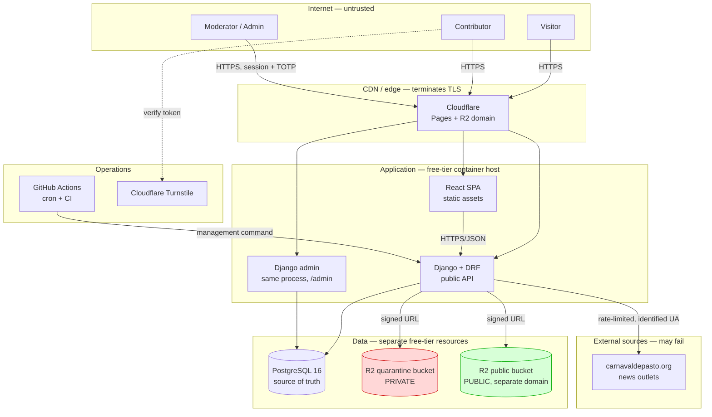

# Deployment

- **Status:** Draft for review
- **Date:** 2026-10-03
- **Relates to:** ADR 0001 (Scrumban, zero-cost constraint from brief §6 decision 6 and §13),
  ADR 0003 (monorepo), ADR 0005 (sessions, no JWT), ADR 0006 (two storage tiers),
  ADR 0009 (stack), ADR 0011 (generated OpenAPI, CI fails on drift),
  `docs/00-acta-proyecto.md` §6 (constraints), `docs/02-diseno/arquitectura-c4.md`

> **The stack is decided** (ADR 0009). The brief §12 platform candidates are still open, and
> this document marks each one **undecided** rather than presenting a settled choice.

## 1. The organising constraint

**Zero monetary cost.** Every choice below must fit a free tier. This is not a nice-to-have:
it is constraint C1 in the acta and it eliminates whole categories of solution (no managed
Kubernetes, no paid APM, no commercial object storage egress, no premium WAF).

The corollary is uncomfortable and must be stated plainly: **free tiers change.**
`carnavaldepasto.org` disappearing is a content risk; a provider re-pricing its free tier is
an *existence* risk for the project. Brief §12 warns about this. Therefore:

> **Re-verify every free-tier limit before each release.** A deploy checklist item, not a
> one-time assumption. Record the check date and the observed limits.

Design consequences of zero cost, all already visible elsewhere:

- **No resident worker.** Scheduling is GitHub Actions `cron` invoking a Django management
  command (ADR 0009). Nothing to keep alive, nothing to pay for.
- **Serverless or single-instance app hosting.** No always-on server.
- **PostgreSQL free tiers are small.** Connection pool and worker counts must be sized to
  the provider's allowance, not to the code's appetite (SEC-59, SEC-60).
- **Storage egress is the real bill risk.** Cloudflare R2 charges no egress; Supabase and
  similar do. This is the decisive factor in ADR 0006's provider choice, not features.

## 2. Environments

| | Local development | Preview / staging | Production |
|---|---|---|---|
| **Purpose** | Feature work, tests | Migration rehearsal, E2E, drift check against a real DB | The public site |
| **How created** | `docker compose` (PostgreSQL + MinIO emulating the two buckets) | Same image as production, separate free-tier resources if available | Manual promotion from `main` |
| **Data** | Synthetic and factories only | Fixture-replayed, never scraped live | Only real moderated content |
| **Access** | The maintainer | The maintainer | Public read; authenticated admin |
| **Secrets** | `.env` (gitignored) | Platform secrets | Platform secrets |
| **Scheduled runs** | Manual command | Manual command | GitHub Actions `cron` |
| **Cost** | Local | Zero or near-zero | Zero |

**Rules that keep environments honest:**

- **No production data is ever copied downward.** Staging is seeded from fixtures, not from a
  production dump. Contributors' email addresses and hashed IPs stay in production.
- **Preview environments are optional.** If the free tier cannot afford a second database,
  staging is the production database with a `DEBUG`-safe deployment plus the E2E suite run
  against a local stack. Recorded as a fallback, not assumed.
- **Local MinIO stands in for S3.** `django-storages` means the interface is identical; only
  the endpoint changes. This is the concrete payoff of the ADR 0006 abstraction.

## 3. Platform candidates — recommendation and trade-offs

None of these are decided. Each row states what would decide it.

| Concern | Candidate A | Candidate B | What tips it |
|---|---|---|---|
| **Frontend hosting** (static React build) | Cloudflare Pages | Vercel | Both have generous free static tiers. Cloudflare keeps the CDN and the storage vendor the same account, which reduces credential count. |
| **API + admin hosting** | A Python container host with a free tier | A serverless Python runtime | The admin is stateful and session-backed (ADR 0005), which constrains this more than a read-only API would. **This is the least-settled choice in the project.** |
| **PostgreSQL** | Neon | Supabase | Both have usable free tiers. Supabase co-locates Storage, which reduces providers to one; Neon is PostgreSQL-only and arguably purer. Neither choice is blocked. |
| **Object storage** | Cloudflare R2 | Supabase Storage | **R2 has no egress fees**, which is decisive for an image-heavy site on a free budget (ADR 0006). Supabase Storage is simpler if Supabase already hosts the database. |
| **Scheduling** | GitHub Actions `cron` | Platform cron | Actions `cron` needs no extra service and no resident worker. Already decided in ADR 0009. |
| **CAPTCHA** | Cloudflare Turnstile | — | Free, no account needed to start. Consistent with a Cloudflare-centred choice. |
| **Email** | Provider transactional API | — | **Undecided.** Needed only for takedown responses and pipeline alerts; nothing public depends on it (SEC-71). |

**Recommended combination, to be confirmed before the MVP deploy:**

Cloudflare Pages (frontend) + a Python container host (API/admin) + Neon or Supabase
(PostgreSQL) + Cloudflare R2 (both storage tiers, separate buckets) + GitHub Actions
(scheduling) + Turnstile (CAPTCHA).

The reason to prefer Cloudflare across three of the four slots is **credential count and
egress cost**, not preference. If the API host proves unable to run Django admin sessions
on a free tier, that is the decision point to revisit — and it should be tested early, not at
release time.

## 4. Secrets

- **Secrets only in environment variables.** Never in `site_settings` (FR-E-11), never in
  git, never in an ADR, never in a doc (SEC-46).
- Required variables, all of which must **fail loudly if absent** rather than defaulting:
  `SECRET_KEY`, `DATABASE_URL`, storage credentials for **both** tiers, the IP-hash salt,
  CAPTCHA keys, and `DEBUG=False` in production.
- **The IP-hash salt is itself a secret.** It lives in the environment, never in the
  database. Rotating it would break the ability to correlate a hash with an address, so it
  must be stable across deploys (PRV-02).
- Local development uses `.env`, which is gitignored. Confirm it stays ignored before any
  scraping work.
- Two credentials sets are needed for storage (quarantine and public), which is a real cost
  of the two-tier design: a leaked public-bucket credential is far less damaging than a
  leaked quarantine one, and they must not be interchangeable.
- Platform secret stores (GitHub Actions secrets, the host's environment settings) are the
  only production location.

## 5. Migrations and schema changes

- `makemigrations --check --dry-run` **gates CI** (NFR-11). Model and migration drift fails
  the build before anything deploys (SEC-56).
- Migrations are **reviewed in the pull request** (NFR-13). A migration that drops or
  rewrites a populated column requires a documented rollback plan in the PR body.
- `migrate` runs as a **release step**, before the new code serves traffic. On a single
  instance there is no window in which two schema versions are live.
- **Forward-only in practice.** Free tiers generally cannot keep two application versions
  running simultaneously, so a blue/green rollback is not available. A failed migration
  means restoring from backup or applying a corrective forward migration. Plan migrations
  accordingly: prefer additive changes (add column, backfill, then remove the old path in a
  later release) over destructive ones.

## 6. Rollback

| Failure | Response |
|---|---|
| Bad code, schema unchanged | Redeploy the previous commit. Fast and safe. |
| Bad migration | Forward corrective migration, or restore from backup (SEC-56). |
| Bad migration, data already lost | **Restore from backup.** This is why backups must be *rehearsed*, not merely configured (NFR-20, US-32). |
| Bad content published | `published → pending` in the admin. Deliberate, audited, immediate (FR-C-05). Data recovery does not require a deploy. |
| Provider outage | The site keeps serving: reads come from PostgreSQL, not from the source (ADR 0002, NFR-06). The pipeline simply fails and records it. |

That last row is the architectural payoff worth restating: **the deployment's hardest failure
mode is degraded, not unavailable.**

## 7. CI/CD

Stages, in order, any failure blocking (NFR-11). Detailed in `docs/03-pruebas/plan-pruebas.md` §7.

```
lint → typecheck → migration check → tests → OpenAPI drift check → build → deploy
```

- **Stage 5 is the mechanical enforcement of ADR 0011:** regenerate the schema and
  `git diff --exit-code` on `docs/02-diseno/openapi.yaml`. A drift fails the build, so the
  contract can never silently diverge from the code.
- **Deploy is gated on `main`.** Branch pushes run everything except the deploy.
- **Secrets are scoped per environment.** A staging run cannot read production credentials.
- E2E and Lighthouse run on branches and `main`, not on every push, to stay inside free
  minutes.
- The deploy step is **manual approval for the first release** and automated thereafter;
  there is exactly one maintainer, so the approval is a ritual, not a control.

## 8. Monitoring and observability at zero cost

**Available:**

| Signal | Mechanism |
|---|---|
| Is the app up? | `/health` endpoint reporting app and database reachability (FR-D-11, brief §18 step 9) |
| Did the pipeline work? | `ingestion_runs` — status, timings, per-stage stats, error message. **The pipeline is its own observability system** (brief §7) |
| Is a source broken? | `scrape_sources.consecutive_failures`, `last_success_at`, `last_error`, surfaced in Django admin (FR-D-12) |
| What changed? | `audit_logs`, append-only, with `request_id` correlation (SEC-51) |
| Did CI pass? | GitHub Actions run history |
| Did the free tier break? | **Periodic manual re-verification** (§1). No automated alert exists for this. |

**Not available on free tiers, and how that is compensated:**

- *No always-on APM or distributed tracing.* Compensated by `request_id` correlation in
  `audit_logs`, which answers "what happened in this request" for the single operator.
- *No log aggregation at scale.* Compensated by structured application logs plus the
  database's own record of what happened.
- *No automatic alerting.* Compensated by GitHub Actions **failing visibly** on a scheduled
  run — a red X on the workflow is the alert — plus the circuit breaker and the
  zero-extraction alarm (FR-B-10, FR-B-11).
- *No uptime monitoring service.* A free external ping is possible; whether it is worth
  adding is **undecided**. The honest position: with one site and one operator, a broken
  deploy is noticed when the maintainer next visits. If that becomes unacceptable, add it.

**Security logging specifically:** successful *and* failed logins, with a salted-hashed IP
(SEC-18). Raw addresses never reach a log line (NFR-19).

## 9. Deployment topology



Note the two buckets rendered in red and green: **`Q` must never be reachable without a
short-lived signed URL issued to the reviewing administrator.** SEC-24 and SEC-25 verify
this, and SEC-25 is the one case that cannot be fully automated — it is a manual release
checklist item.

## 10. Pre-launch checklist

Run before the first public deploy, and again before any release that changes providers.

- [ ] **Re-verify every free-tier limit**; record the date and the observed numbers (§1).
- [ ] **Contact Corpocarnaval** (brief §20) — courtesy, and the last chance to learn of an
      objection before the site is public. The letter is drafted in
      `docs/comunicacion-corpocarnaval.md`; sending it and recording the answer is a human
      act. It is also the only mitigation for the missing terms of use.
- [ ] The **unofficial / not-affiliated disclaimer** is visible on every page, including
      error pages (FR-A-09, LEG-08).
- [ ] `robots.txt` and terms of use reviewed and recorded per source, even where the answer
      is "unknown" (SEC-65, `docs/fuentes-y-atribucion.md`).
- [ ] **Secrets are absent from the repository and its history** (SEC-46). Scan both.
- [ ] `.env` is gitignored; `data/raw/` and `*.pdf` are still ignored (SEC-35).
- [ ] `DEBUG=False` in production; `ALLOWED_HOSTS` set; HTTPS enforced with HSTS.
- [ ] Security headers present, including on error responses (SEC-43); CORS restricted
      (SEC-44).
- [ ] Django admin is **not** indexed by search engines (NFR-21).
- [ ] **A fresh install does not expose unreviewed `pending` content** (FR-D-03). Django
      admin ships with full permissions by default; verify roles are seeded before any human
      logs in.
- [ ] The first administrator was created by the seed command, and no public signup path
      exists (SEC-12).
- [ ] Quarantine bucket confirmed private and separately addressed (SEC-24, SEC-25).
- [ ] `makemigrations --check` passes (SEC-56); the OpenAPI schema drift check passes
      (NFR-11, NFR-12, ADR 0011).
- [ ] Backup taken and **restore rehearsed**, not merely configured (NFR-20).
- [ ] The takedown contact address is published and monitored (FR-G-03).
- [ ] **Every legal page carries the DRAFT notice** (`docs/legal/`, ADR 0016). There will be
      **no** professional review — that was decided on 2026-10-04 — so the notice is the only
      control there is, and it must sit above the content, not in a footer. Brief §11, §20.

## 11. Backup and restore (NFR-20)

- **What is backed up:** the PostgreSQL database — schema and data. It is the source of
  truth (ADR 0002); `raw_documents` payloads are a cache and are **not** backed up.
- **How:** a scheduled `pg_dump` (the provider's scheduled backups where the free tier offers
  them, otherwise a GitHub Actions job that dumps and stores the compressed file in a private
  bucket), with a documented retention.
- **Restore rehearsal:** restoring the latest dump into a scratch database reproduces the
  published catalogue. The procedure is exercised **once per version release**, not merely
  written — this is the requirement, and it is the item most likely to rot unchecked.
- **What it does not cover:** object storage. Approved public images are the one thing a
  database backup cannot reproduce, so from v2 they are copied alongside it.
