# Use case diagram

- **Status:** Draft for review
- **Date:** 2026-10-03
- **Relates to:** ADR 0001 (versions), ADR 0002 (database as truth), ADR 0005 (Django admin,
  sessions, no JWT), ADR 0006 (quarantine), ADR 0007 (video as links), ADR 0008 (versioned
  delivery), ADR 0010 (bilingual), `docs/01-requisitos/srs.md`, `docs/00-acta-proyecto.md` §4

Use case names are given in **Spanish and English** because both are legitimately needed:
`es` is the source locale for the site (ADR 0010) while this repository and its design
documents are in English (AGENTS.md, *Language*).

> **This is a stand-in, not a UML use case diagram (ADR 0014).** Mermaid has no use case
> notation: no stick-figure actors, and no `<<include>>` or `<<extend>>`. The `graph TB`
> below uses subgraphs for actors and use case groups, so it reads like the real thing while
> carrying none of UML's semantics. **The authoritative artefact is the 26-row register in
> §2** — every use case appears there and in the diagram exactly once. Where one use case
> implies another, that belongs in the register's text, because it cannot be drawn here.

## 1. Diagram

```mermaid
graph TB
    subgraph ACT["Actores / Actors"]
        V[Visitante<br/>Visitor]
        COL[Colaborador<br/>Community contributor]
        ED[Moderador / Editor]
        ADM[Administrador]
    end

    subgraph EXT["Actores externos / External systems"]
        SRC[("Sistema de origen<br/>(scraped source)")]
        BKT[("Almacenamiento<br/>Object storage")]
        CAP[("CAPTCHA")]
        MAIL[Correo]
        SCHED[("GitHub Actions<br/>scheduler")]
    end

    subgraph UC["Casos de uso / Use cases"]
        direction TB

        subgraph G1["1. Lectura / Reading — MVP"]
            U1[UC-01 · Consultar ediciones<br/>Browse editions]
            U2[UC-02 · Ver programa por día<br/>Read programme by day]
            U3[UC-03 · Ver detalle de evento<br/>View event detail]
            U4[UC-04 · Ver noticias<br/>View news]
            U5[UC-05 · Ver galería histórica<br/>View historical gallery]
            U6[UC-06 · Ver cita y autoría<br/>View citation and credit]
            U7[UC-07 · Buscar<br/>Search]
            U8[UC-08 · Cambiar de idioma<br/>Switch locale]
        end

        subgraph G2["2. Aporte / Contributing — v3"]
            U9[UC-09 · Enviar imagen<br/>Submit image]
            U10[UC-10 · Enviar enlace de vídeo<br/>Submit video link]
            U11[UC-11 · Aceptar términos y consentimiento<br/>Accept terms and consent]
            U12[UC-12 · Consultar estado del envío<br/>Check submission status]
        end

        subgraph G3["3. Moderación / Moderating — v1, v3"]
            U13[UC-13 · Ver cola de revisión<br/>Review queue]
            U14[UC-14 · Aprobar<br/>Approve]
            U15[UC-15 · Rechazar con motivo<br/>Reject with reason]
            U16[UC-16 · Retirar de publicación<br/>Unpublish]
            U17[UC-17 · Responder solicitud de retiro<br/>Respond to takedown]
        end

        subgraph G4["4. Administración / Administering — v1, v2, v3"]
            U18[UC-18 · Configurar ajustes del sitio<br/>Edit site settings]
            U19[UC-19 · Configurar fuente de scraping<br/>Configure scrape source]
            U20[UC-20 · Lanzar o reintentar ingesta<br/>Trigger or retry ingestion]
            U21[UC-21 · Ver historial de ingesta<br/>View ingestion runs]
            U22[UC-22 · Auditar registro<br/>View audit log]
            U23[UC-23 · Gestionar usuarios y roles<br/>Manage users and roles]
            U24[UC-24 · Gestionar versiones legales<br/>Manage legal document versions]
            U25[UC-25 · Autocompletar contenido a mano<br/>Author content manually]
            U26[UC-26 · Copia de seguridad y restauración<br/>Backup and restore]
        end
    end

    V --> U1
    V --> U2
    V --> U3
    V --> U4
    V --> U5
    V --> U6
    V --> U7
    V --> U8

    COL --> U9
    COL --> U10
    COL --> U11
    COL --> U12

    ED --> U13
    ED --> U14
    ED --> U15
    ED --> U16
    ED --> U17
    ED --> U20
    ED --> U21
    ED --> U22

    ADM --> U13
    ADM --> U14
    ADM --> U15
    ADM --> U16
    ADM --> U17
    ADM --> U18
    ADM --> U19
    ADM --> U20
    ADM --> U21
    ADM --> U22
    ADM --> U23
    ADM --> U24
    ADM --> U25
    ADM --> U26

    U9 -.->|"«include»"| U11
    U10 -.->|"«include»"| U11
    U9 -->|"«include»"| CAP
    U10 -->|"«include»"| CAP
    U14 -.->|"«include»"| BKT
    U15 -.->|"«include»"| BKT
    U20 -->|"«invoke»"| SCHED
    SCHED -->|"«invoke»"| U20
    U20 -->|"reads"| SRC
    U20 -->|"writes"| BKT
    U21 -->|"reads"| SRC
    U17 -.->|"«notify»"| MAIL
```

`-.->` is an `«include»` or `«notify»` relationship; a solid line is an association.
`UC-20` is bidirectional with the scheduler because it is both invoked *by* it and reports
*to* it through `ingestion_runs`.

## 2. Use case register

Priority is MoSCoW per version (ADR 0008). Requirement IDs refer to
`docs/01-requisitos/srs.md`.

### 1. Reading — MVP

| ID | Name (es / en) | Actor | Preconditions | Postconditions | Main flow | Alternate / error flows | Ver. | Pri. | Version |
|---|---|---|---|---|---|---|---|---|---|
| UC-01 | Consultar ediciones / Browse editions | Visitante | Site is up | Visitor has seen available years | List published editions → open one | Empty list renders an explicit empty state; an unpublished edition 404s (FR-A-10, SEC-47) | FR-A-01, FR-A-10 | Must | MVP |
| UC-02 | Ver programa por día / Read programme by day | Visitante | An edition is published | Visitor sees the days in order | Open edition → days chronologically → events in `sort_order` | A day with no events shows an empty state, not a blank page (FR-A-02) | FR-A-02, FR-A-04, FR-A-08 | Must | MVP |
| UC-03 | Ver detalle de evento / View event detail | Visitante | Event is published | Visitor sees times, venue, source link | Open event → read details → follow source link | Missing venue or time renders as an explicit absence (FR-A-03) | FR-A-03, FR-A-05, FR-A-12 | Must | MVP |
| UC-04 | Ver noticias / View news | Visitante | News items published | Visitor sees headline, outlet, date, own summary, link out | Open news list → read item → follow link to the original | Never shows full article text or article images (FR-E-02, SEC-34) | FR-E-01, FR-E-02 | Must | v2 |
| UC-05 | Ver galería histórica / View historical gallery | Visitante | Approved assets exist | Visitor browses historical images | Open gallery → browse → open an asset | An asset with unknown rights is **never** here (FR-E-05, SEC-30) | FR-E-04, FR-E-07 | Must | v2 |
| UC-06 | Ver cita y autoría / View citation and credit | Visitante | Asset is published | Visitor sees author, source, licence, citation | Open asset → read the citation text → copy it | Citation absent blocks publication entirely (LEG-03) | FR-E-06, LEG-03 | Must | v2 |
| UC-07 | Buscar / Search | Visitante | Search is enabled in v2 | Visitor gets results | Enter a term → results | Scoped to `published` only (FR-I-02); no paid service (FR-I-03) | FR-I-01, FR-I-02 | Should | v2 |
| UC-08 | Cambiar de idioma / Switch locale | Visitante | None | Page renders in the target language; choice persists | Switch → same page in the other locale | Root redirects to the negotiated locale, defaulting to `es` (FR-H-04); a missing key fails the build, never degrades (SEC-48) | FR-H-01 … FR-H-05 | Must | MVP |

### 2. Contributing — v3 (all anonymous)

| ID | Name (es / en) | Actor | Preconditions | Postconditions | Main flow | Alternate / error flows | Ver. | Pri. | Version |
|---|---|---|---|---|---|---|---|---|---|
| UC-09 | Enviar imagen / Submit image | Colaborador | Terms and consent accepted; CAPTCHA solved | A `submission` and `submission_files` row exist as `pending`; file is in quarantine | Fill form → declare rights → upload → pass CAPTCHA → submit | Renamed executable rejected (SEC-19); oversized rejected (SEC-22); quota exceeded rejected (SEC-22, SEC-45); CAPTCHA failure silently dropped via honeypot (SEC-27) | FR-F-01, FR-F-03 … FR-F-07, FR-F-16, FR-F-17 | Must | v3 |
| UC-10 | Enviar enlace de vídeo / Submit video link | Colaborador | Terms and consent accepted | A `pending` submission stores provider + video id | Paste URL → provider validated → normalise to id | Non-allowlisted host rejected; a video **file** is always rejected; the URL is never used raw as an embed `src` (SEC-36, ADR 0007) | FR-F-02, FR-F-19 | Must | v3 |
| UC-11 | Aceptar términos y consentimiento / Accept terms and consent | Colaborador | Legal documents are published | A `consent_records` row binds to the exact version | Read terms → tick the unchecked checkbox → submit | Submitting without consent is refused server-side regardless of what the client claims (SEC-29); a new legal version never rewrites historical consent (SEC-28) | FR-F-10, FR-F-11, PRV-05 | Must | v3 |
| UC-12 | Consultar estado del envío / Check submission status | Colaborador | Has the unguessable token | Contributor sees status and, if rejected, the reason | Open status URL with token → read status | An invalid token reveals nothing and does not confirm existence (FR-F-18) | FR-F-18 | Should | v3 |

### 3. Moderating — v1 and v3

| ID | Name (es / en) | Actor | Preconditions | Postconditions | Main flow | Alternate / error flows | Ver. | Pri. | Version |
|---|---|---|---|---|---|---|---|---|---|
| UC-13 | Ver cola de revisión / Review queue | Moderador, Administrador | Authenticated with role | Moderator sees pending items with source and raw payload | Log in → filter by `status`/`origin`/type → open an item | A `viewer` reaching this is a permission failure, not an empty queue (SEC-13) | FR-C-06, FR-C-09 | Must | v1 |
| UC-14 | Aprobar / Approve | Moderador, Administrador | Item is `pending` | `status = published`, `reviewed_by`, `reviewed_at`, `moderation_actions` row | Open item → compare with source → approve | Publication blocked if rights are unknown or a minor lacks guardian consent (SEC-30, SEC-31); a bulk approval records each item individually (SEC-57) | FR-C-03, FR-C-07, FR-E-05, FR-F-09 | Must | v1 |
| UC-15 | Rechazar con motivo / Reject with reason | Moderador, Administrador | Item is `pending` | `status = rejected` with a non-empty reason | Open item → reject → type a reason | An empty reason is refused by a `CHECK` constraint (FR-C-04); a rejected upload is deleted or retained per policy, recorded either way (FR-C-10) | FR-C-04, FR-C-07 | Must | v1 |
| UC-16 | Retirar de publicación / Unpublish | Moderador, Administrador | Item is `published` | `status` returns to `pending`; item leaves the public API | Open item → unpublish | Deliberate manual action only — never automatic (FR-C-05) | FR-C-05 | Must | v1 |
| UC-17 | Responder solicitud de retiro / Respond to takedown | Moderador, Administrador | A request exists | `action_taken` and `responded_at` recorded | Read claim → triage → act → record | `illegal_content` sets `escalated` and **cannot** be closed by an internal note alone (FR-G-05, SEC-73); for embedded video, remove the reference and contact the provider (FR-G-07) | FR-G-04, FR-G-05, FR-G-06 | Must | v3 |

### 4. Administering

| ID | Name (es / en) | Actor | Preconditions | Postconditions | Main flow | Alternate / error flows | Ver. | Pri. | Version |
|---|---|---|---|---|---|---|---|---|---|
| UC-18 | Configurar ajustes del sitio / Edit site settings | Administrador | Authenticated as `admin` | `site_settings` changed and audited | Open settings → edit → save | Secrets cannot be stored here (FR-E-11, SEC-46); an `editor` is refused (SEC-13) | FR-E-10, FR-E-12 | Must | v2 |
| UC-19 | Configurar fuente de scraping / Configure scrape source | Administrador | Authenticated as `admin` | `scrape_sources` changed and audited | Add or edit URL, type, active flag, rate limit, cron | Selectors are data, not code — no arbitrary execution (US-16) | FR-B-12 | Must | MVP |
| UC-20 | Lanzar o reintentar ingesta / Trigger or retry ingestion | Moderador, Administrador | A source is configured | An `ingestion_runs` row records the outcome | Trigger a source → observe stages | Retry with backoff; after N consecutive failures the source auto-disables and alerts (FR-B-10, SEC-39); a **zero-extraction** result is an alarm, not a success (FR-B-11, SEC-40) | FR-B-17, FR-B-18 | Must | MVP |
| UC-21 | Ver historial de ingesta / View ingestion runs | Moderador, Administrador | Runs exist | Moderator sees status, timings, per-stage stats | Open run history → open a run | The pipeline is its own observability system (brief §7) | FR-B-08, FR-D-12 | Must | v1 |
| UC-22 | Auditar registro / View audit log | Moderador, Administrador | Authenticated | Actor, action, object, timestamp visible | Filter by actor, action, date | Append-only for **every** role including `admin` (FR-D-09, SEC-16, SEC-50); IPs are salted hashes only (SEC-18, SEC-32) | FR-D-08, FR-D-09, FR-D-10 | Must | v1 |
| UC-23 | Gestionar usuarios y roles / Manage users and roles | Administrador | Authenticated as `admin` with TOTP | Users and group membership changed | Add user → assign group → enrol TOTP | **No public signup exists** (FR-D-13, SEC-12); the first admin comes only from the seed command (FR-D-14) | FR-D-02, FR-D-03, SEC-04 | Must | v1 |
| UC-24 | Gestionar versiones legales / Manage legal document versions | Administrador | Legal texts reviewed | A new version becomes current | Create a new version → set effective date → mark current | One current version per type and locale (FR-G-01); a published document is **never** edited in place (FR-G-02, SEC-28) | FR-G-01, FR-G-02 | Must | v3 |
| UC-25 | Autocompletar contenido a mano / Author content manually | Administrador | Authenticated | A record with `origin = manual` exists as `pending` | Create a record by hand → review → publish | The scraper is optional: this path works with every source dead (ADR 0002, US-13) | FR-C-01, NFR-06 | Must | v1 |
| UC-26 | Copia de seguridad y restauración / Backup and restore | Administrador | Backups configured | A database is restored | Take a backup → restore to a scratch database → verify | Must be **rehearsed**, not merely configured (NFR-20) | NFR-13, NFR-20 | Must | v1 |

## 3. Two properties worth reading off the diagram

**Which use cases are anonymous.** Everything in group 1 and group 2. A visitor needs no
account; a contributor needs no account. The only authenticated human surface in the entire
system is Django admin (ADR 0005), reached by the moderator and the administrator. There is
no third-party or mobile client, which is why no token scheme exists.

**Which use cases record a human decision.** UC-14, UC-15, UC-16, UC-17, UC-18, UC-19,
UC-23, UC-24 and UC-25 all append to `audit_logs`, and the first four also append to
`moderation_actions`. That is the enforcement of **LEG-01 / FR-C-02: nothing reaches
`published` without a recorded human decision.** The diagram shows where that promise is
cashed: every path into `published` passes through UC-14, and the only other writer of
content is UC-25, which also ends in a review.

## 4. Coverage against the SRS

| SRS group | Use cases |
|---|---|
| FR-A Catalogue and browsing | UC-01 … UC-03, UC-08 |
| FR-B Ingestion pipeline | UC-19, UC-20, UC-21 |
| FR-C Moderation | UC-13 … UC-16, UC-25 |
| FR-D Admin, roles, audit | UC-22, UC-23, UC-26 |
| FR-E Editorial content | UC-04, UC-05, UC-06, UC-18 |
| FR-F Public submissions | UC-09 … UC-12 |
| FR-G Legal and takedown | UC-17, UC-24 |
| FR-H Internationalisation | UC-08 |
| FR-I Search | UC-07 |
| FR-D-11 Health | Not a use case; an operational endpoint (brief §18 step 9) |

Requirements with no use case, consistent with the gaps recorded in
`docs/01-requisitos/matriz-trazabilidad.md`: FR-A-11 (filtering is an implementation detail of
UC-02), FR-B-16 (retention is an operations task with no actor), FR-H-06/H-07 (an
editorial translation workflow, planned for v2), and the NFR/SEC/PRV/LEG quality attributes,
which constrain every use case rather than describing one.
