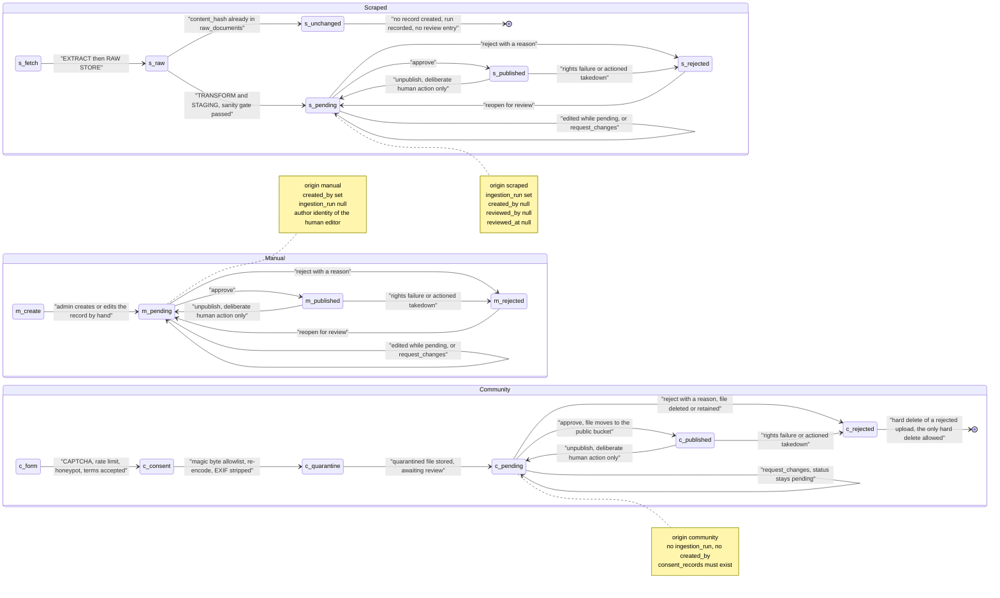

# Moderation state machine

- **Status:** Draft for review
- **Date:** 2026-10-03
- **Relates to:** brief §7 (nothing is published without review), §8 (moderation fields),
  §9 (RBAC), §10 (public contributions), §11 (rights); ADR 0002 (invariants), ADR 0006
  (quarantine), ADR 0007 (video links), ADR 0008 (submissions last);
  `docs/01-requisitos/srs.md` §3.3 (FR-C-01 … FR-C-09) and §3.6 (FR-F-07, FR-F-09);
  `docs/03-pruebas/casos-seguridad.md` (SEC-17, SEC-28 … SEC-31, SEC-36);
  `docs/02-diseno/modelo-datos.md` §2, §6, §9; `docs/02-diseno/flujo-datos.md`
- **Implementation:** shared `moderation` service in Django; `status` and `origin` enums;
  database `CHECK` constraints; `moderation_actions` and `audit_logs` written in the same
  transaction

## 1. The shared model

Every table whose rows can become public carries the mixin: the programme spine
(`editions`, `days`, `venues`), the editorial tables (`events`, `news_items`,
`media_assets`) and `submissions` (`modelo-datos.md` §2):

| Field | Type | Meaning |
|---|---|---|
| `status` | enum | `pending` → `published` \| `rejected` |
| `origin` | enum | `scraped` \| `manual` \| `community` |
| `reviewed_by` | FK → `auth.User`, nullable | Who decided |
| `reviewed_at` | datetime, nullable | When |
| `rejection_reason` | text, `NOT NULL DEFAULT ''` | **Required** (non-empty) when `status = rejected` |
| `ingestion_run` | FK → `ingestion_runs`, nullable | Set when `origin = scraped` |
| `created_by` | FK → `auth.User`, nullable | Set when `origin = manual` |

Invariants, enforced by application code and, where possible, by the database
(`modelo-datos.md` §2 and §9):

- `status = 'rejected'` requires a non-empty `rejection_reason` (`CHECK`).
- `origin = 'scraped'` requires `ingestion_run`; `origin = 'manual'` requires `created_by`.
- `origin = 'community'` requires neither, and must have an associated `submissions` row.
- **Nothing transitions out of `published` automatically.** Downgrading to `pending` is an
  explicit human action.

`moderation_actions` (§6.5) is the second, separate record of the same decision: an
append-only log kept because it is the evidence trail for a rights or takedown dispute.
`audit_logs` (§5.1) is the operational trail covering the whole project. A transition writes
**all three**: the field update, a `moderation_actions` row, and an `audit_logs` row.

## 2. Lifecycle

The three origins share the same three statuses and the same transitions. What differs is
**how a record arrives** and **who must decide**: a scraped record is a machine proposal, a
manual record is a human draft, a community record is untrusted anonymous input that has
already been through file validation before it reached the queue.

There is one arrival state that is not a moderation state: `c_form → c_consent →
c_quarantine` is the submission intake path (§5), before the record exists as `pending`.
Intake failures never reach the queue.

## 3. Transitions

| From | To | Trigger | Actor | Side effects | Reversible |
|---|---|---|---|---|---|
| — | `pending` | Extraction, validation and the sanity gate pass | Pipeline (`actor_kind = pipeline`, `actor = null`) | `raw_documents` row exists; `ingestion_runs.stats` incremented; `audit_logs` row. Nothing is publicly readable (FR-B-06, FR-A-06) | Yes, by rejecting it |
| — | `pending` | Admin creates the record by hand | `editor` or `admin` | `origin = manual`, `created_by` set, `reviewed_by` null; `audit_logs` row. Creating is not publishing | Yes, by rejecting it |
| — | `pending` | Submission passes intake and lands with a quarantined file | System, then a human decides | `submissions` row, `submission_files` row in the **quarantine** bucket (FR-F-07), `consent_records` row, `moderation_actions` row with `action = submit` | Yes, by rejecting it |
| `pending` | `pending` | Field edit, or `request_changes` with feedback | `editor` or `admin` | Field update, `updated_at`; `audit_logs` row. `request_changes` writes `moderation_actions.reason` and leaves `status` pending, so the CHECK constraint is not triggered | Yes, by another edit |
| `pending` | `published` | **Approve** | `editor` or `admin` (FR-C-03) | `status`, `reviewed_by`, `reviewed_at`; `moderation_actions` row `approve` (FR-C-07); `audit_logs` row. For a submission: file moves quarantine → public bucket, `quarantine_file` cleared, an approved `media_assets` row is created (FR-F-09). The record becomes readable by the public API | Yes, via `published → pending` |
| `pending` | `rejected` | **Reject** | `editor` or `admin` (FR-C-04) | `status = rejected` with a **non-empty** `rejection_reason` (CHECK constraint); `reviewed_by`, `reviewed_at`; `moderation_actions` row `reject` with `reason`; `audit_logs` row. A rejected upload's file is deleted or retained per the retention policy | Yes, via `rejected → pending` |
| `published` | `pending` | **Unpublish** — deliberate, manual, never automatic | `editor` or `admin` (FR-C-05, SRS §2.2) | `status = pending`, `reviewed_at` refreshed; new `moderation_actions` and `audit_logs` rows; the item disappears from the public API at once. Nothing is deleted | Yes, re-approve. The row is untouched in the meantime |
| `published` | `rejected` | Rights failure (licence withdrawn, a photograph is of a minor without guardian consent) or an actioned takedown | `admin` | Same as rejection above, plus the public asset and the citation are withdrawn. The `takedown_requests` row records `status = actioned` and `action_taken` | Only by reopening into `pending` and re-approving |
| `published` | `published` | Field edit to live content | `editor` or `admin` | **Constrained — see §4.** A direct edit is an unreviewed change to public content, so it is permitted only through the reviewed proposal path (open item 1 in `flujo-datos.md` §5.1) | n/a |
| `rejected` | `pending` | Reopen for review — new evidence, a corrected upload, an error found | `editor` or `admin` | `status = pending`, `rejection_reason` retained for the record, `reviewed_by` and `reviewed_at` **cleared**; new `moderation_actions` and `audit_logs` rows | n/a — it is the entry to the queue again |
| `pending` | withdrawn | The contributor withdraws, using the `public_token` status lookup | Anonymous holder of the token | `moderation_actions` row `withdraw`; quarantined file deleted per ADR 0006. **How the status is represented is undecided** — see §4 | No |

**There is no `rejected → published` edge.** Rejection must be re-examined through `pending`.
A direct promotion would let a decision be overturned without ever being looked at again,
which defeats the purpose of requiring a reason.

## 4. Rules

**R1. Nothing reaches `published` without a human decision** (FR-C-02, LEG-01, SEC-47).
Scraped, manual and community content all land as `pending`. This is an invariant in
ADR 0002, in `AGENTS.md`, and in `modelo-datos.md` §2 — not a workflow preference.

**R2. Auto-publish is off by default** (FR-C-08, MoSCoW **Could**, v1; ADR 0002 permits the
capability). **Undecided:** where the rule set lives; the data model has no
`auto_publish_rules` table. Proposed default: a typed `site_settings` key
(`moderation.auto_publish_rules`) holding an explicit list of `(content_type, origin)`
pairs, empty by default — an allowlist, never a wildcard. Any record an automated rule
publishes still gets an `audit_logs` row with `actor_kind = system`, so "no human decision"
can never become "no record". Recommendation: keep the list empty until the review queue has
been shown to work in practice, and revisit only if queue volume becomes the real constraint.

**R3. A rejection is always explained** (FR-C-04). `rejection_reason` is required and
non-empty (`CHECK` constraint, `modelo-datos.md` §9; SEC-17 asserts it). The same text is
written to the `moderation_actions` row, so the explanation exists twice, in the record and
in the dispute-evidence log. A rejection with a blank reason is a database error, not a valid
state.

**R4. Every transition writes three things** — the field update, a `moderation_actions` row
(FR-C-07), and an `audit_logs` row (FR-D-08, SEC-17) — in the same transaction. The three logs
are not redundant:

| Log | Purpose | Who reads it |
|---|---|---|
| Field values on the record | Current state, one query | The site, the API |
| `moderation_actions` | Who decided what, with reasons, append-only | A rights claim or a takedown dispute |
| `audit_logs` | Whole-project operational trail, including pipeline actions, logins and configuration changes (brief §9) | Operations and incident response |

**R5. Decision fields are honest.** `reviewed_by` and `reviewed_at` are set on every decision
and **cleared on reopen**, so a pending row never carries the ghost of a previous verdict.
With a single operator (ADR 0001) the creator and the approver may be the same person; that
is recorded truthfully rather than disguised.

**R6. Unpublishing is a deliberate act.** `published → pending` happens when a human performs
it. It is never a side effect of a re-run, a re-import, a rights sweep, a takedown timer, or
any other automatic process. There is no scheduled job anywhere in this project that can
remove published content.

**R7. Withdrawal representation — undecided.** `moderation_actions.action` includes
`withdraw`, but `status` has only three values. Proposed default: withdrawal sets
`status = rejected` with the system `rejection_reason` "Withdrawn by the contributor" — so
the CHECK constraint holds and the daily quota is released — plus a `withdraw` action row so
the true cause is distinguishable. The alternative, adding a `withdrawn` status, changes
`modelo-datos.md` §2 and needs an ADR.

**R8. Field edits to published rows — undecided.** See open item 1 in `flujo-datos.md` §5.1.
Proposed default: a content field on a `published` row is read-only in the admin form;
changes go through the reviewed proposal path and are applied by an explicit action that
writes the same `moderation_actions` and `audit_logs` rows as an approval.

## 5. Lifecycle of a public submission

v3 only (ADR 0008): public submissions are deliberately last, gated behind working
moderation and reviewed legal documents. This is intake plus moderation, and it is the only
path in the project where anonymous, untrusted input reaches the database. A submission
follows the same moderation path as everything else and enters as `pending` (FR-F-22).

```mermaid
flowchart LR
    V["Anonymous visitor"] --> FORM["Form: kind, description, declared author,<br/>year, place, optional contact email,<br/>unchecked and blocking terms checkbox"]
    FORM --> GUARD["CAPTCHA, honeypot, per-IP rate limit,<br/>per-IP quota, global daily pending quota"]
    GUARD --> CONSENT["consent_records row:<br/>exact legal_documents version, accepted_at,<br/>ip_hash, user_agent_hash,<br/>declaration_rights, declaration_minor_subject"]
    CONSENT --> BYTES["Magic byte allowlist: JPEG, PNG, WebP<br/>a video disguised as an image is rejected here<br/>size limits enforced before storage"]
    BYTES --> REENC["Full decode and re-encode, EXIF and GPS stripped,<br/>duplicate detection by content_hash"]
    REENC --> QUAR["Private quarantine bucket:<br/>submission_files.quarantine_key,<br/>mime_detected from magic bytes"]
    QUAR --> QROW["submissions row: status pending,<br/>origin community, public_token issued<br/>moderation_actions: submit"]
    QROW --> DEC{"Reviewer decision"}

    DEC -- "approve" --> MOVE["Move the object from the quarantine bucket<br/>to the public bucket on a separate domain<br/>set media_assets.file, clear quarantine_file<br/>X-Content-Type-Options nosniff,<br/>explicit Content-Disposition"]
    MOVE --> ASSET["Approved media_assets row:<br/>author, source_ref, license, citation_text,<br/>rights_status not unknown, exif_stripped true,<br/>minor_subject implies guardian_consent_on_file"]
    ASSET --> LIVE["status published on the submission and the asset,<br/>moderation_actions approve, audit_logs approve"]

    DEC -- "reject" --> REASON["rejection_reason recorded,<br/>moderation_actions reject with reason,<br/>audit_logs reject"]
    REASON --> DEL{"Retention policy, undecided"}
    DEL -- "delete now, proposed default" --> PURGE["Quarantined file deleted.<br/>A rejected upload is the only hard delete allowed"]
    DEL -- "retain for a period" --> HOLD["Retained under the retention policy,<br/>private, never served, deadline recorded"]

    DEC -- "request changes" --> FEED["moderation_actions request_changes with reason,<br/>status stays pending,<br/>contactor notified only if contact_email was given"]
```

Points that are decisions rather than mechanics:

- **The checkbox is unchecked by default and blocking** (FR-F-10, SEC-29), the rights and
  identifiable-person declarations are collected (FR-F-13, FR-F-14), and the exact
  `legal_documents` version accepted is recorded (FR-F-11, PRV-05, FR-G-01, SEC-28). Legal
  documents are never edited after publication — a change creates a new version (FR-G-02) —
  so an old `consent_records` row stays interpretable forever (`modelo-datos.md` §6.4).
- **The file is never publicly readable before approval** (FR-F-07, SEC-24, SEC-25). It lives in a
  private bucket and is shown to the reviewer only through a short-lived signed URL
  (ADR 0006).
- **Validation is by content, not by filename** (FR-F-03, FR-F-04, ADR 0006): the magic-byte
  allowlist is JPEG, PNG and WebP, `mime_detected` comes from the bytes, `declared_mime` is
  kept to detect mismatches, and the file is fully re-encoded so embedded payloads cannot
  survive (FR-F-05, SEC-19, SEC-20).
- **Approval creates an approved `media_asset`** (FR-F-09). Publishing an image requires
  author, `source_ref`, `citation_text` and `rights_status != unknown` (FR-E-05, LEG-02,
  SEC-30), with `exif_stripped = true` verified at approval time (FR-E-08) and — where
  `minor_subject` is set — `guardian_consent_on_file` (FR-F-15, LEG-09, SEC-31). **Open
  item:** `media_assets` has no FK to `submissions`, yet §2 requires a `community` row to
  have one. Proposed default: a nullable `submission` FK on `media_assets`.
- **Rejection deletes the file or retains it under the retention policy**, always with a
  recorded reason (ADR 0006, brief §10). **Undecided:** which. Proposed default: delete
  immediately; the contributor has a `public_token` status lookup, so retaining a copy of an
  image they no longer want has no evident purpose and costs storage on a free tier.
- `contact_email` is optional, is PII, is never exposed through the public API, and carries a
  deletion deadline once the matter is closed (`modelo-datos.md` §8, PRV-03, SEC-33).
- A quota matters here: without a global daily cap on pending submissions, anonymous
  uploads become a storage-exhaustion vector (SEC-22, SEC-27, SEC-45, brief §10 and §14).

## 6. Lifecycle of an embedded video link

ADR 0007 and FR-F-02: the platform accepts video links only and never hosts video files.

| Stage | What happens |
|---|---|
| Submitted | A canonical watch URL is submitted as `submissions.kind = video_link`, landing `pending` with `origin = community`. Intake is the same as §5 minus the file path: CAPTCHA, rate limit, honeypot, terms, `consent_records`. |
| Normalised | The URL is parsed into `video_provider` (`youtube` \| `vimeo`) and a normalised `video_id`. **The submitted URL is never used as an iframe `src`** (FR-F-19, SEC-36). The embed is rendered from the stored provider plus id. |
| Rejected at intake | Any attempt to upload a video file is rejected by the magic-byte allowlist, including a video renamed with an image extension (ADR 0006, SEC-19). There is no code path that stores one. |
| Approved | `status = published`. Rendered as an embed through the provider's official player, with `youtube-nocookie.com` for YouTube, a consent notice before loading (PRV-08), and a plain link as fallback if the embed is blocked (ADR 0007). |
| Rejected | `rejection_reason` recorded; the reference is dropped — `video_provider` and `video_id` cleared — plus `moderation_actions` and `audit_logs` rows. Nothing was ever stored in the project's own storage, so nothing has to be deleted there. |
| **Removed later** | Removal is **not** a takedown of project-held media, because the project holds no copy. It means two separate acts: **the project drops its own reference** to the embed — `video_id` cleared and the record unpublished or rejected with a reason — **and the request is passed to the provider**, who owns the hosted copy and who has their own process. FR-G-07 states this split, and the `takedown_requests` row records which half was done. |
| The video disappears from the provider | The embed goes dead. Accepted and recorded in the moderation queue for re-review (ADR 0007). It is **not** treated as a takedown, because the project never asked for the removal. |

## 7. Open items

| # | Item | Status | Proposed default |
|---|---|---|---|
| 1 | Storage and shape of auto-publish rules (R2, FR-C-08, Could) | **undecided** | Empty-by-default allowlist in `site_settings`; `audit_logs` still records `actor_kind = system` |
| 2 | How contributor withdrawal is represented (R7) | **undecided** | `status = rejected` with a system reason, plus a `withdraw` action row |
| 3 | Field edits to a `published` row (R8) | **undecided** — open item 1 in `flujo-datos.md` §5.1 | Read-only content fields on published rows; changes applied through the reviewed proposal path |
| 4 | File retention on rejection (§5) | **undecided** | Delete immediately |
| 5 | Whether an `editor` may unpublish (§3) | **Resolved** — FR-C-05 and SRS §2.2 place unpublish with the `editor`; recorded here so the matrix and the SRS agree |
| 6 | `media_assets` → `submissions` link (open item in §5) | **undecided** — needs a `modelo-datos.md` amendment | Nullable `submission` FK on `media_assets` |
| 7 | Whether contributors are notified of `request_changes` and approval | **undecided** | Notify only when `contact_email` was given; requires a sending path and a privacy note in the legal documents |
| 8 | Approved, no `modelo-datos.md` change | Approved | `reviewed_by` and `reviewed_at` cleared on reopen; no `rejected → published` edge |

## 8. References

- ADR 0002 — nothing is published without review; auto-publish permitted but off; full traceability.
- ADR 0004 — `rights_status = unknown` is never published; MIT covers code only.
- ADR 0006 — quarantine and public tiers; validation by magic bytes; rejection deletes or retains.
- ADR 0007 — video links only; removal means dropping the reference and contacting the provider.
- ADR 0008 — public submissions are v3, gated behind working moderation.
- `docs/01-requisitos/srs.md` §3.3 (FR-C-01 … FR-C-09), §3.5 (FR-E-05, FR-E-08), §3.6
  (FR-F-03 … FR-F-10, FR-F-14, FR-F-19), §3.7 (FR-G-01, FR-G-02, FR-G-07), §6 (PRV-03,
  PRV-05, PRV-08), §7 (LEG-01, LEG-02, LEG-09).
- `docs/03-pruebas/casos-seguridad.md` — SEC-17 (every moderation action recorded), SEC-19
  and SEC-20 (magic bytes, polyglot), SEC-22 (quota), SEC-24 and SEC-25 (quarantine is not
  public), SEC-28 and SEC-29 (consent), SEC-30 and SEC-31 (rights gates), SEC-33 (PII),
  SEC-36 (video embeds), SEC-45 (rate limits), SEC-47 (published only), SEC-73 (takedown
  state machine).
- `docs/02-diseno/modelo-datos.md` §2 (mixin), §6 (submissions, moderation actions, takedowns), §9 (constraints).
- `docs/02-diseno/flujo-datos.md` — how records reach `pending`, and what happens on failure.
- `docs/02-diseno/roles-permisos.md` — who may perform each transition (matrix rows 4–11).
- `docs/01-requisitos/matriz-trazabilidad.md` — requirement-to-test mapping.
- Brief §7, §8, §9, §10, §11; `docs/00-acta-proyecto.md` §7 success criterion 4.