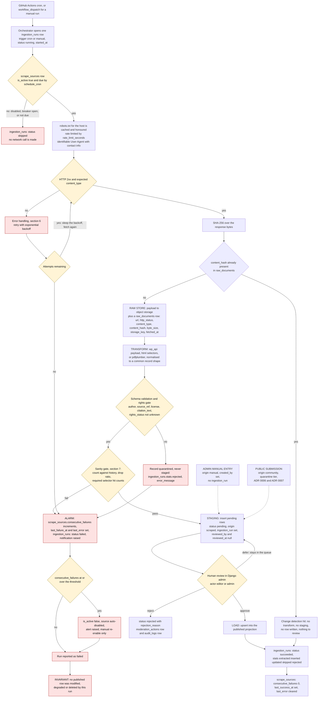
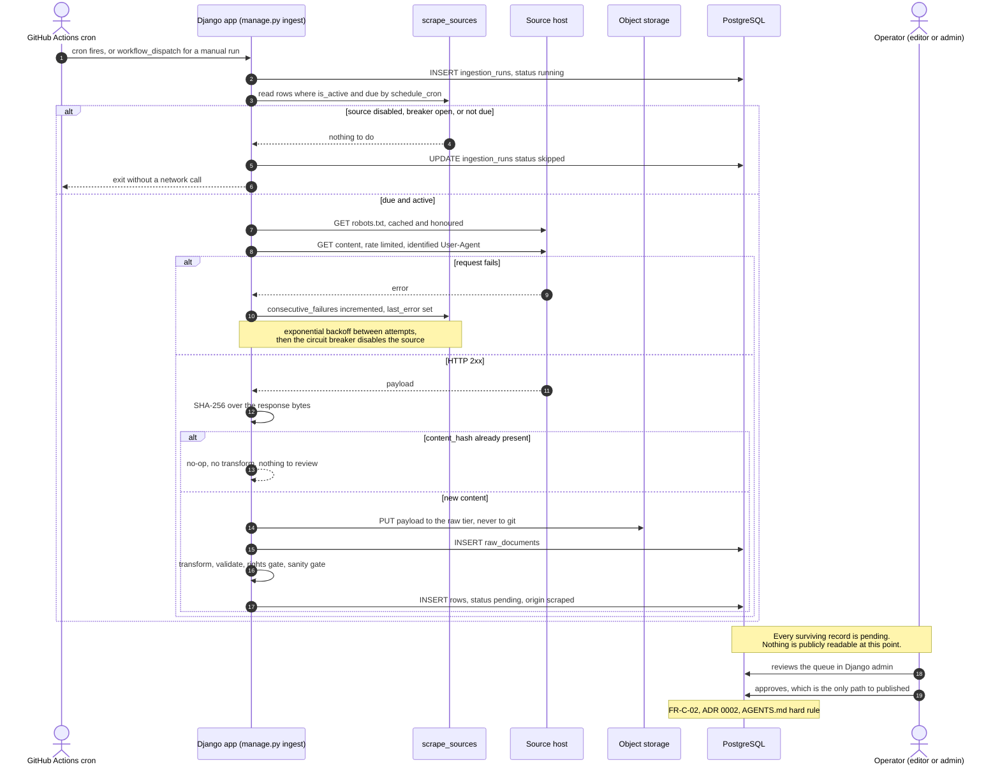

# Data flow and ingestion pipeline

- **Status:** Draft for review
- **Date:** 2026-10-03
- **Relates to:** ADR 0002 (database as source of truth) — this document is ADR 0002 made
  operational; brief §7 (pipeline), §8 (data model), §9 (audit), §11 (respecting sources),
  §14 (risks), §16 (Definition of Done); ADR 0004, ADR 0006, ADR 0008, ADR 0009
  (GitHub Actions `cron`); `docs/01-requisitos/srs.md` §3.2 (FR-B-01 … FR-B-19) and §3.3
  (FR-C-02); `docs/03-pruebas/casos-seguridad.md` §E (SEC-37 … SEC-42);
  `docs/02-diseno/modelo-datos.md`
- **Implementation:** Django 5 management commands, `httpx`, `selectolax` / `pdfplumber`,
  PostgreSQL 16, object storage via `django-storages`

## 1. Purpose and the one rule that shapes everything

This document specifies how data enters the database, when it is reprocessed, what happens
when it cannot be obtained, and how a published record can be traced back to the run that
produced it.

ADR 0002 is the decision; this is its mechanics. Everything below exists to satisfy its
invariants, which are requirements rather than aspirations:

1. **Idempotent** — running the pipeline twice must not duplicate data (FR-B-04).
2. **Nothing is published without review** — every record enters as `status = pending`
   (FR-B-06, FR-C-02, LEG-01).
3. **Traceable** — every record stores `origin` plus the `ingestion_run` or user that made it.
4. **Failure never degrades published data** (FR-B-09, NFR-06).
5. **The scraper is optional** — the admin can create and edit every record by hand.
6. **Resilient** — retry with backoff, circuit breaker, alerting (FR-B-10).

The stages are those of brief §7, unchanged:

```
EXTRACT → RAW STORE → TRANSFORM → STAGING (pending) → human review → LOAD (published)
```

## 2. Pipeline diagram



Two entry points bypass stages 1–4 and join at staging. They are drawn dotted to make it
explicit that they are **not** part of the pipeline: admin-authored and community content
never enters `raw_documents` and never carries an `ingestion_run`, but they arrive at exactly
the same `pending` gate and are moderated by exactly the same rules
(`docs/02-diseno/estados.md`).

### 2.1 One scheduled run, as an interaction

The diagram above shows **what** happens; this shows **who talks to whom, and in what
order** — the view the flowchart cannot express. The last note is the point of the whole
diagram: reaching the end of a successful run still leaves nothing publicly readable.



## 3. Stage by stage

| # | Stage | Input | Processing | Output | Tables and objects touched | Failure behaviour |
|---|---|---|---|---|---|---|
| 0 | **Entry / scheduling** | GitHub Actions `cron`; a per-source `schedule_cron` expression; an optional `workflow_dispatch` for a manual run | Decide which sources are due and whose breaker is closed; open one `ingestion_runs` row per source | An `ingestion_runs` row with `trigger = cron` or `manual`, `status = running`, `started_at` | `ingestion_runs`, `scrape_sources` (read) | A source that is disabled, not due, or breaker-open is skipped **without a network call**; the run is recorded `status = skipped`, not `failed`. Workflow concurrency group prevents overlapping runs of the same source. |
| 1 | **EXTRACT** | `scrape_sources.url`, `source_type` (`wp_api` \| `html` \| `pdf`), `selector_*` jsonb, `rate_limit_seconds`, `user_agent` | Fetch with `httpx`: honour `robots.txt` (cached per host, proposed 24 h), wait `rate_limit_seconds` between requests, send the identifiable `User-Agent` required by brief §11. Prefer the WordPress REST API over HTML when it answers (brief §5, still unverified). Prefer the WP API path and the `wp_object_type` / `wp_object_id` pair over CSS selectors | The response bytes in memory, plus `http_status` and `content_type` | `scrape_sources` (read), `ingestion_runs` (read) | 5xx, timeout, connection and DNS errors: retry with exponential backoff (§7). 429: honour `Retry-After` and back off. 4xx other than 429: permanent, no retry, counts as a failure. `403` on `robots.txt` disallow or on the target: the source is **disabled and flagged for human review**, never worked around. Every attempt increments the breaker counter; exhausting attempts raises the alarm. |
| 2 | **RAW STORE** | Response bytes | SHA-256 the bytes; if `content_hash` already exists in `raw_documents`, stop here (change detection, §6). Otherwise write the payload to private object storage under `storage_key` and insert the `raw_documents` row | An immutable `raw_documents` row: the idempotency record and the offline copy of exactly what the source said | `raw_documents` (insert only), object storage private bucket | A storage or database failure fails the run. **The `content_hash` UNIQUE constraint is the last line of defence**: a concurrent duplicate insert raises `IntegrityError`, which is caught and treated as a no-op rather than a crash. Payloads are never committed to git (`data/raw/` and `*.pdf` are in `.gitignore`, ADR 0004). |
| 3 | **TRANSFORM** | The stored payload, the source's selectors or parser | Parse with the source-type handler, normalise to a common record shape, validate against the target schema, and apply the rights gate: `author`, `source_ref`, `license`, `citation_text` present and `rights_status != unknown` (brief §11, ADR 0004). News keeps headline, URL, outlet, date and a short **own** summary — never the article body or its images | A list of candidate records, each fully attributed, none yet visible | `raw_documents` (read), `ingestion_runs` (update `stats`) | A parse or schema failure quarantines the affected records: they are counted in `stats.rejected` with `error_message`, nothing is staged, and the run is marked failed through the alarm path. The raw payload stays in storage so the breakage can be inspected offline. |
| 4 | **STAGING (pending)** | Validated candidate records | Apply the sanity gate (§8). Then insert one row per record with `status = pending`, `origin = scraped`, `ingestion_run` set, `reviewed_by` and `reviewed_at` null. `editions` and `days` rows are created by the pipeline when missing (proposed; open item 2 in `modelo-datos.md` §10) | A review queue. **Nothing is public.** Auto-publish rules are admin-configurable but off by default (ADR 0002) | `events`, `news_items`, `editions`, `days`, `ingestion_runs` (insert / update) | Any duplicate-key collision resolves as an update to the existing pending row, never a second row. The load path refuses to overwrite a row whose `origin` is `manual` or `community` (§10). |
| 5 | **Human review** | Pending rows in Django admin | An `editor` or `admin` decides per record. Approve, reject with a reason, or edit and leave pending. Full rules in `docs/02-diseno/estados.md` | `status = published` or `status = rejected`, with `reviewed_by`, `reviewed_at`, `rejection_reason` | the moderation mixin tables, `moderation_actions`, `audit_logs` | There is no timeout and no fallback. A stale pending row simply stays pending; the site is unaffected and a reviewer sees its age. |
| 6 | **LOAD (published)** | An approved record | Upsert into the published projection. The published projection is the same table with `status = published`, so "load" means: the approved row becomes publicly readable by the API. For an approved **change** to already-published content, see §5 and open item 1 | Publicly readable, cited, attributed content | the moderation mixin tables, `audit_logs` | Idempotent by construction: the transition is keyed on the record identity, so re-running the load path cannot duplicate a row. |

## 4. Idempotency

Idempotency is not a feature added at the end; it is the reason `raw_documents` exists.

1. **`raw_documents.content_hash` is `UNIQUE`** (`modelo-datos.md` §3.6 and §9). It is the
   SHA-256 of the fetched bytes. The uniqueness is enforced by the database, not by
   application logic that could be skipped.
2. **Hash-gated reprocessing.** A fetch whose `content_hash` is already present is recorded
   as a no-op: no transform, no staging, no review queue entry. Unchanged input is not
   reprocessed at all, which is what makes routine runs cheap on a rate-limited source.
3. **Upsert on the load path.** The publish transition resolves the record by its natural
   key and updates in place rather than inserting, so even a replayed load produces one row.
4. **Queue-level idempotency.** Staging resolves pending rows by the same natural key, so
   two runs of the same payload cannot produce two pending rows.
5. **`IntegrityError` is data, not a crash.** A duplicate `content_hash` insert from a
   concurrent run is caught and reported as a skip.

**Consequence: running the pipeline twice over the same unchanged source produces zero
duplicates** — zero duplicate `raw_documents` rows, zero duplicate pending rows, zero
duplicate published rows, and an empty review queue on the second run. This is the acta's
success criterion 3 (`docs/00-acta-proyecto.md` §7), FR-B-03 and FR-B-04, and it is already
registered as executable cases in `docs/03-pruebas/casos-seguridad.md`:

| Case | What it asserts | Requirement |
|---|---|---|
| **SEC-37** | Seed a clean database, run the pipeline twice over one fixture, diff every table: the second run produces zero inserts and zero duplicates | FR-B-03, FR-B-04, ADR 0002 |
| **SEC-38** | Fail a source (500, then malformed markup) with `published` rows present: every `published` row is byte-identical afterwards | FR-B-09, NFR-06 |
| **SEC-39** | Fail a source N times, then run again: the source is auto-disabled, an alert is raised, `last_error` and `last_failure_at` are recorded, and no further request is made | FR-B-10 |
| **SEC-40** | Replay a fixture whose markup changed and yields zero records: an alarm, no silent success, no deletion of `published` rows | FR-B-11 |
| **SEC-41** | Instrument the HTTP calls over a multi-page fixture: the configured interval is observed between requests to the same source | FR-B-13, LEG-07 |
| **SEC-42** | Inspect outbound headers in a fixture run: the `User-Agent` carries contact information, not a library default | FR-B-14, LEG-07 |
| SEC-35 | Assert `data/raw/` and `*.pdf` stay git-ignored, and scan the tracked tree and its history | FR-B-19, LEG-05 |

Two of these are the cases this document exists to make pass: SEC-37 (§4) and SEC-40 (§7).

**Fixtures, never live sources** (`AGENTS.md`, NFR-16, brief §14). Tests replay payloads
committed under `backend/tests/fixtures/<source_name>/<case_name>/`, each directory holding
the raw response body plus a `meta.json` with the URL, status, content type and the
`content_hash` the pipeline should compute (`docs/03-pruebas/plan-pruebas.md` §1). HTTP is
mocked, so a test that forgets to mock fails against a local stub rather than against
`carnavaldepasto.org`. A test must never reach a live source: source markup changes yearly,
and stale fixtures that test obsolete markup give false confidence.

## 5. Change detection

- The unit of change detection is the **fetched payload**, not the record: the SHA-256 over
  the response bytes. Unchanged bytes ⇒ no work. Changed bytes ⇒ the whole document is
  re-transformed and re-staged.
- Within a changed payload, records are compared **field by field** against what is already
  in the database. An unchanged record produces no row and no queue entry; only records
  whose fields actually differ are staged.
- **If a source changes a single field** of one record — a start time moves, a title is
  reworded — the whole document's hash changes, so the transform re-runs over every record
  in it, and exactly one record is staged as different. That is the cost of hash-per-
  document detection, and it is paid on a source that changes once a year (brief §5).

### 5.1 What happens to a change to already-published content — **undecided**

This is the one place where the data model does not yet provide a mechanism, and it must
not be resolved by writing to a published row.

The moderation mixin has one row per record, not a revision history, and no column holds a
proposed change. `modelo-datos.md` has no `revision`, `supersedes` or `staged_changes`
column. Three candidate mechanisms:

| Option | Mechanism | Cost |
|---|---|---|
| **A** | Add a nullable `staged_changes` jsonb column to the mixin holding the proposed field values plus the proposing `ingestion_run`; a reviewer applies them in the admin, which writes `moderation_actions` and `audit_logs` and clears the proposal | One column per content table; keeps "no publication without a decision" exact; keeps the published row untouched until a human acts |
| **B** | Add a revision table with a `supersedes` FK; `pending → published` on a revision overwrites the live row | A new table plus new legal and audit semantics; `modelo-datos.md` §9 constraints must be extended |
| **C** | No staging for changes to published rows: the pipeline reports the diff and an editor retypes it by hand | Zero schema change; the scraper's convenience value drops sharply and the diff report is easy to ignore |

**Proposed default: Option A.** It is the only one where the review gate that ADR 0002
requires is mechanically unavoidable, and it is the same gate the pipeline already passes
through for new records. **This requires its own ADR and an amendment to `modelo-datos.md`
before implementation**; until then, the pipeline must **not** silently overwrite a
published row, and open item 1 in §13 tracks it.

## 6. Error handling

### 6.1 Retry with exponential backoff

`delay = base × 2^(attempt − 1)`, capped, with jitter. **Proposed defaults, undecided:**
`base = 5 s`, `N = 3` attempts, `cap = 300 s`. Only transport-level failures are retried:
5xx, timeouts, connection resets, DNS and TLS errors. A 4xx other than 429 is permanent and
is not retried — retrying a 404 wastes requests against a rate-limited source. A 429 honours
`Retry-After`.

### 6.2 Circuit breaker on `scrape_sources`

The breaker state is columns on the source row, editable in Django admin
(`modelo-datos.md` §3.5) and shown in the review dashboard, which is what FR-D-12 and brief §7
require (the panel shows each source's active flag, consecutive failures and last successful
run):

| Column | Meaning on failure |
|---|---|
| `consecutive_failures` | Increments on every failed attempt (fetch, parse, or sanity-gate failure); reset to 0 on any success |
| `last_failure_at` | When it last failed |
| `last_error` | The message, shown in the admin |
| `is_active` | Set to `false` by the breaker once `consecutive_failures` reaches the threshold; a human re-enables it |
| `last_success_at` | Untouched by a failure; the dashboard's "last good run" |

**Proposed threshold: N = 5 consecutive failed runs** (undecided; FR-B-10 requires the
behaviour, not the number, and SEC-39 is the case that pins it down). Auto-disabling on a
single run would be defeated by one flaky afternoon; a high threshold would keep hammering a
source that is gone. Manual re-enable is deliberate: a human reads `last_error` first.

A breaker tripped by a **sanity-gate** failure is a distinct and important case: the source
answers `200` and looks healthy, but its markup changed, so re-enabling without a fix simply
re-arms a broken extractor.

### 6.3 Alerting

Raised on: breaker trip, run `status = failed`, sanity-gate failure. Proposed channels, both
free at this scale (undecided whether to add a third): the GitHub Actions job failure, which
surfaces in the repository's own notifications, and an email via `django.core.mail`. The
dashboard state in §6.2 is the durable record; alerting is only how a human learns there is
something to look at.

### 6.4 The absolute rule

> **A failed run never modifies, degrades or deletes a `published` row.** (FR-B-09, SEC-38,
> NFR-06)

Mechanically: the pipeline's only writes to content tables are (a) inserts of `pending` rows
at staging and (b) writes to `audit_logs` and `ingestion_runs`. The load path runs only from
an explicit human approval. There is no code path in which a fetch or parse error reaches a
`published` row — not even a field update, not even a timestamp. This is what "the site
keeps serving" means operationally, and it is the reason the scraper is a convenience rather
than a dependency (ADR 0002).

## 7. Partial failure: the markup-change case

> **This is the brief's top risk (§14): "the site changes its structure and breaks the
> scraper", rated high impact.** It is FR-B-11, and SEC-40 is the case that exists for it.

The dangerous case is not an error. It is a `200 OK` with a body the extractor can no longer
understand, where the extractor confidently produces **zero records** and reports success.
Without a guard, the run is green, the review queue is empty, and nobody notices for months.
An empty queue looks exactly like a quiet source.

**It is an alarm condition, never a silent success.** The sanity gate runs after a payload
has been stored and after records have been validated, but **before** anything is staged:

| Check | Threshold | Rationale |
|---|---|---|
| Zero-yield stop | `stats.extracted == 0` while the source's last successful run extracted > 0 | The unambiguous markup-change signal. Hard stop. |
| Drop ratio | `stats.extracted < 0.5 × median(stats.extracted of the last 5 successful runs)` | A partial selector breakage. Median, not mean, so one anomalous run does not become the new baseline. Hard stop. |
| Spike ratio | `stats.extracted > 3 × median(previous 5 successful runs)` | The inverse failure: a navigation menu or a related-posts block now parses as "events". Hard stop. |
| Selector hits | Any required selector matches 0 elements | Detects the breakage **before** it becomes a record count. Counts are written to `stats.selector_hits` so a near-miss is visible. |
| Field completeness | Any required field null in > 20% of records | Layout change that keeps the record count but empties a field. |

All ratios and the completeness figure are **undecided**; the values above are proposed
defaults and must be calibrated against real fixtures during the source spike (brief §18
step 4) before being hard-coded.

On any trip: the raw payload **is** kept (the failure is reproducible offline and the
diff is the diagnostic), nothing is staged, `ingestion_runs.status = failed`,
`error_message` names the tripped check, `consecutive_failures` increments, and the alarm
fires. The breaker can then disable the source.

The deeper containment property: because nothing is ever auto-published, a markup change can
at worst fill the review queue with wrong records. A human sees them. The public site stays
correct. The sanity gate exists to make the human find out **today**, not next year — it is a
detector, not the containment boundary. That boundary is human review.

## 8. Scheduling

- **GitHub Actions `cron` invokes a Django management command** (ADR 0009). There is **no
  resident worker, no queue, and no always-on process**: constraint C1 in
  `docs/00-acta-proyecto.md` is zero cost, and a free tier that must be kept awake is a
  liability.
- `scrape_sources.schedule_cron` holds the per-source cron expression
  (`modelo-datos.md` §3.5). **Undecided implementation, proposed default:** one workflow with
  a small number of `on.schedule` entries plus a single dispatcher command
  (`manage.py ingest_source --due`) that selects the sources whose `schedule_cron` is due
  relative to `last_success_at`, and accepts `--source <name>` or `--all` to run explicitly.
- `workflow_dispatch` produces a run with `trigger = manual`; an `editor` or `admin` may
  launch a run for **one** source (FR-B-18), while running everything at once or re-enabling
  a breaker-disabled source stays with `admin` (FR-D-07, and
  `docs/02-diseno/roles-permisos.md` rows 17–18).
- A workflow `concurrency` group per source prevents two runs of the same source overlapping,
  which would otherwise waste rate-limit budget and race on the breaker counter.
- Session and expired-token pruning (`clearsessions`) runs in the same schedule.
- Free-tier cron in GitHub Actions is subject to usage limits and can be delayed under
  load; the pipeline is designed so a delayed run is harmless — unchanged input is skipped
  (§4) and nothing is published automatically.

## 9. Traceability: from a published record back to its run

Three columns do the work, and they are required together:

| Column | On a scraped record | Answers |
|---|---|---|
| `origin` | `scraped` | Was this created by the pipeline, by a person, or by the public? |
| `ingestion_run` | FK → `ingestion_runs` | Which run staged it? |
| `created_by` | null | Confirms it was **not** hand-authored — the CHECK constraints in `modelo-datos.md` §2 make these mutually exclusive |

From there:

1. `ingestion_runs` gives `scrape_source`, `trigger`, `status`, `started_at`, `finished_at`,
   `stats` and `error_message` — the whole run.
2. `ingestion_runs.scrape_source` gives the URL, selectors, `user_agent`, breaker counters and
   `last_success_at`.
3. `audit_logs` gives the human decisions. Pipeline activity is written with
   `actor_kind = 'pipeline'` and `actor = null`; human activity with `actor_kind = 'human'`.
4. `audit_logs.request_id` correlates an audit row with the run's structured logs.
5. `raw_documents` gives the exact bytes the record came from, addressable by
   `content_hash`, retained offline.

A single query — *show me everything behind this published `news_item`* — walks
`news_items.ingestion_run → ingestion_runs → scrape_sources → raw_documents` and
`news_items.reviewed_by → audit_logs`. That is the evidence a copyright claim or a takedown
needs (`docs/00-acta-proyecto.md` §4, brief §11).

A `manual` record instead resolves through `created_by → auth_user → audit_logs`. A
`community` record resolves through its `submissions` row and its `consent_records`. There
is no fourth case, and a record with no resolvable producer is a data defect to be rejected
in review, not published.

## 10. Manual override: the scraper is a convenience, not a dependency

The admin can create and edit **every** record by hand. That is ADR 0002's fifth invariant
and brief §7's stated fallback, and it is what makes losing the scraper a loss of
convenience rather than of availability.

- A hand-authored record is created with `origin = manual` and `created_by` set; it has no
  `ingestion_run` (`modelo-datos.md` §2 requires that pairing).
- It still lands as `status = pending` and is published by the same human decision as any
  other record. Creating content is not the same act as publishing it, and collapsing them
  would reopen the door the whole moderation model exists to close. With a single operator
  (ADR 0001) the same user appears as `created_by` and `reviewed_by`; that is recorded
  honestly in `moderation_actions` and `audit_logs` rather than disguised. A two-person rule
  is not applicable to a solo project and is not claimed.
- **The pipeline must never overwrite a `manual` or `community` row.** The load and staging
  paths resolve candidates by natural key **and** `origin = 'scraped'`. A scraped record
  colliding with a hand-authored one is reported as a conflict for a human to resolve, never
  silently merged. Without this rule, re-running the scraper would quietly undo hours of
  manual editorial work — the pipeline would become an author.
- Consequently, if every source is disabled forever, the site still functions, keeps its
  archive, accepts new submissions, and can be updated by hand. That is the property ADR 0002
  bought, and the failure test in §4 is what proves it.

## 11. Open items

| # | Item | Status | Proposed default |
|---|---|---|---|
| 1 | Mechanism for staging a change to an already-published record (§5.1) | **undecided** — needs an ADR and a `modelo-datos.md` amendment | `staged_changes` jsonb on the moderation mixin, applied by a reviewer (Option A) |
| 2 | Natural key for `events` on the load path. `news_items.url` is a natural key; `events` has only a non-unique `(day, sort_order)` index (`modelo-datos.md` §3.4) | **undecided** | Persist the upstream identity from the source (WP object id for `wp_api`, canonical URL for `html`/`pdf`) in a `source_record_key` column; unique per `ingestion_run` lineage |
| 3 | Whether `editions` and `days` are seeded by the pipeline (`modelo-datos.md` §10 open question 2) | **undecided** | Pipeline-seeded, since day names differ per year |
| 4 | `raw_documents` retention window (`modelo-datos.md` §10 open question 3, SRS §9.3) | **undecided** | Keep the last 20 payloads per source (FR-B-16, SRS §9.3), plus any payload still referenced by a live record |
| 5 | All numeric thresholds in §6 and §7, including the breaker threshold N | **undecided** | Calibrate against real fixtures during the source spike (brief §18 step 4); SEC-39 asserts the behaviour, not the number |
| 6 | Exact management-command names and the cron dispatch mechanism (§8) | **undecided** | `manage.py ingest_source`, with `--due`, `--source`, `--all` (FR-B-17) |
| 7 | Alerting channels beyond the GitHub Actions failure (§6.3) | **undecided** | `django.core.mail`; no third-party alerting service at zero cost |

## 12. References

- ADR 0002 — ingestion backend with the database as the source of truth (the invariants).
- ADR 0004 — MIT for code only; no third-party material in git; `rights_status = unknown`
  blocks publication.
- ADR 0006 — two storage tiers; the quarantine bucket is where a raw payload and an
  unapproved file live.
- ADR 0008 — MVP delivers the pipeline; the review queue arrives in v1.
- ADR 0009 — Django 5, PostgreSQL 16, GitHub Actions `cron` invoking management commands.
- `docs/01-requisitos/srs.md` §3.2 (FR-B-01 … FR-B-19), §3.3 (FR-C-02), §4 (NFR-06, NFR-16),
  §7 (LEG-05, LEG-07), §9.3 (retention).
- `docs/03-pruebas/casos-seguridad.md` §E — SEC-37 … SEC-42; `docs/03-pruebas/plan-pruebas.md`
  §1 — mocked HTTP and committed fixtures.
- `docs/02-diseno/modelo-datos.md` — table and field names used verbatim here.
- `docs/02-diseno/estados.md` — the moderation transitions referenced from stages 5 and 6.
- `docs/02-diseno/roles-permisos.md` — who may act in stage 5, and matrix rows 17–21.
- `docs/02-diseno/autenticacion.md` — the accounts that act in stage 5.
- `docs/01-requisitos/matriz-trazabilidad.md` — the requirement-to-test mapping for every
  numbered reference above.
- `docs/00-acta-proyecto.md` §6–§7 — constraints C1, C3 and success criterion 3.
- Brief §7 (pipeline), §9 (audit), §11 (respecting sources, rights), §14 (risks),
  §16 (Definition of Done), §18 step 4 (source spike).