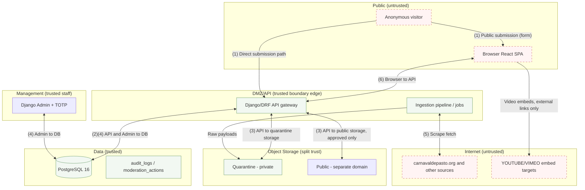

# STRIDE threat model — Carnaval de Negros y Blancos

**Status:** Draft for review  
**Date:** 2026-10-03  
**Relates to:** ADR 0002 (database as source of truth), ADR 0004 (MIT code only), ADR 0005 (Django sessions + TOTP), ADR 0006 (quarantine/public storage), ADR 0007 (video links external), ADR 0009 (Python + Django + DRF + PostgreSQL), ADR 0010 (bilingual), ADR 0011 (OpenAPI generated). Also brief §5, §6, §8, §9, §10, §11, §14 (risks).  
**Method:** STRIDE (Spoofing, Tampering, Repudiation, Information disclosure, Denial of service, Elevation of privilege) applied per element of the data-flow diagram described below, with explicit trust-boundary analysis. Mermaid is the diagram tool (project decision).

## 1. Introduction

This document is the STRIDE threat model for the system. The scope covers the public read API, public submission endpoint, Django admin, authentication/session handling, ingestion pipeline, raw document storage, quarantine storage, public storage, audit log, database, third-party fetch, and email/notification path. It references only controls that exist in the ADRs or in the authoritative data model (`docs/02-diseno/modelo-datos.md`). Where a control is not yet decided, that is stated explicitly. The test reference scheme is `SEC-01`, `SEC-02`, ..., implemented in `docs/03-pruebas/casos-seguridad.md` (**74 cases**, `SEC-01` … `SEC-74`).

## 2. Assets and scope

Key assets: programme data (events/days/editions), editorial content (news_items), historical media_assets, submissions and submission_files, consent_records and legal_documents, audit_logs and moderation_actions, user/session state, secrets, and raw documents. The publishing principle is: nothing reaches `published` without human review (brief §11). The scraper is optional (ADR 0002).

## 3. Trust-boundary analysis and data-flow diagram

System boundaries and trust zones (from design):

- (1) public internet → Django/DRF API
- (2) API → PostgreSQL
- (3) API → object storage (quarantine and public tiers)
- (4) Django admin → database
- (5) Django → external sources being scraped (carnavaldepasto.org)
- (6) browser (React SPA) → API

Trust zones:
- Zone P (Public): browser SPA (no auth), anonymous submitter, CDN/storage public endpoint.
- Zone I (Internet): public internet, third-party sources.
- Zone T (DMZ/API): Django/DRF application tier.
- Zone M (Mgmt): Django admin (authenticated staff).
- Zone D (Data): PostgreSQL (confidential state).
- Zone S (Storage private): quarantine bucket/domain (private), public bucket/domain (public) — separate tiers/domains (ADR 0006).
- Zone E (External): carnavaldepasto.org, YouTube/Vimeo embeds (videos are external links only; ADR 0007).

### 3.1 DFD (Mermaid)

**Notes on boundaries:** (1) public internet → Django/DRF API is the edge (rate limits, validation, CSRF where applicable); (2) API → PostgreSQL is internal data boundary; (3) API → object storage splits into quarantine (private) and public (separate domain) tiers; (4) Django admin → database is management boundary; (5) Django → external sources is outbound fetch boundary (unidirectional pull); (6) browser SPA → API is browser boundary.

## 4. Per-element STRIDE table

Elements covered: public read API, public submission endpoint, admin panel, authentication/session handling, ingestion pipeline, raw document storage, quarantine storage, public storage, audit log, database, third-party fetch, email/notification path. IDs: `T-01` onward.

> **Case IDs.** The last column cites case IDs from the executable register in
> `docs/03-pruebas/casos-seguridad.md` (`SEC-01` … `SEC-74`). **The two numbering schemes are
> independent and deliberately not 1:1**: one threat may need several cases, and one case may
> serve several threats. These are *not* the SRS `SEC-nn` requirement IDs, which are a third
> scheme — each case header in the register names the SRS requirements it maps to.
>
> An earlier draft of this table assumed a 1:1 correspondence and cited `SEC-nn` by matching
> the threat number. That was wrong for `T-01` … `T-49` — it produced references to unrelated
> cases (for example, "session fixation" pointing at the polyglot-file case). The column has
> been corrected against the real register. `T-50` … `T-72` were already correct.

| Threat ID | Element | Category (STRIDE) | Description | Affected asset | Likelihood (L) | Impact (I) | Existing mitigation (from ADRs/data model) | Residual risk | Verification case(s) — `docs/03-pruebas/casos-seguridad.md` |
|---:|---|---|---|---|---:|---:|---|---|---|
| T-01 | public read API | S (Spoofing) | Anonymous read only; spoofing not the main vector but client could impersonate user agent. | Public content | Low | Low | Read-only endpoints; no auth tokens issued (ADR 0005). No session for public reads. | Minimal (abuse only). | `SEC-47`, `SEC-15` — public endpoints require no credentials, and an anonymous caller reaches no authenticated endpoint. |
| T-02 | public read API | T (Tampering) | Response tampering in transit or cache poisoning. | Public payloads | Low | Low | HTTPS always; no sensitive data returned; public content is non-confidential. | Low if HTTPS enforced. | `SEC-43`, `SEC-49` — transport headers present on every response; cache headers cannot be poisoned across locales. |
| T-03 | public read API | R (Repudiation) | No audit of anonymous reads by design. | Availability/observability | Low | Low | No PII on reads; access metrics via logs without storing raw IP (hashed only in consent/audit contexts; brief §10). | Accepted (operational only). | `SEC-32` — anonymous reads write no PII to `audit_logs`; no raw IP is stored anywhere. |
| T-04 | public read API | I (Information disclosure) | Enumerate UUIDs or leak unpublished content. | Unpublished data | Low | Med | UUIDv4 as public identifiers (data model §1); only `status=published` returned for public content; RBAC enforced server-side (ADR 0005). | Low if filters correct. | `SEC-47` — unpublished records are never returned; UUID enumeration reveals no hidden state. |
| T-05 | public read API | D (DoS) | Request floods, expensive queries. | Availability | Med | Med | Rate limiting at edge/API; read-only; free-tier constraints. | Medium (mitigated procedurally if extreme). | `SEC-45` — rate limiting and pagination bounds are enforced on public reads. |
| T-06 | public read API | E (Elevation of privilege) | Attempt to inject query params to access admin data. | Privileged data | Low | High | RBAC server-side on every request (ADR 0005); public endpoints isolated from admin serializers; no JWT (no token confusion). | Low if strict separation. | `SEC-15`, `SEC-58` — parameter tampering reaches no privileged scope and no unparameterised SQL. |
| T-07 | public submission endpoint | S | Submit as fake identity; CAPTCHA bypass. | Submissions | Med | Med | Anonymous submissions accepted by design; CAPTCHA + honeypot + per-IP limits (brief §10); no public accounts. | Medium residual (bot abuse). | `SEC-27`, `SEC-22` — anti-abuse controls validated; the honeypot drops automated posts. |
| T-08 | public submission endpoint | T | File tampering (polyglot, re-named extension), crafted form. | submission_files | High | High | Magic bytes allowlist (JPEG/PNG/WebP), **not extension**; full decode + re-encode; EXIF stripped (ADR 0006); quarantine tier. | Medium (defense-in-depth). | `SEC-19`, `SEC-20`, `SEC-21` — polyglot rejected, mime detected by magic bytes, EXIF absent after processing. |
| T-09 | public submission endpoint | R | Deny submission or dispute consent. | consent_records | Med | Med | Consent recorded with **exact legal-document version** and timestamps; `consent_records` stores `ip_hash` (salted), `user_agent_hash` (nullable), declarations (data model §6.3). Append-only in effect. | Low if versioning enforced. | `SEC-28` — consent is bound to an exact legal-document version and is immutable per submission. |
| T-10 | public submission endpoint | I | EXIF/GPS leakage, raw PII in fields. | Privacy (minors, location) | High | High | EXIF removal including GPS; files in private quarantine until approved; `ip_hash` only (salted) in consent; `contact_email` stored but not exposed publicly and carries retention deadline (data model §8). | Medium (human approval required). | `SEC-21`, `SEC-32`, `SEC-33` — EXIF/GPS absent after processing, no raw IP persisted, contact email never exposed publicly. |
| T-11 | public submission endpoint | D | Storage exhaustion, spam floods. | Storage/quota | High | Med | Size/count limits per submission and per IP; daily quota of pending; CAPTCHA; duplicate detection by content hash (ADR 0006); quarantine bounded. | Medium (operational). | `SEC-22`, `SEC-23` — quota and size limits enforced; duplicate content hashes refused. |
| T-12 | public submission endpoint | E | Upload path attempts to write outside quarantine. | Public storage | High | High | Two separate tiers/domains; move from quarantine to public only on approval transaction (ADR 0006); direct signed uploads to private bucket; no public write. | Low if storage isolation strict. | `SEC-24`, `SEC-25` — promotion is approved-only; no public write path exists. |
| T-13 | admin panel | S | Account spoofing, credential stuffing. | auth_user | Med | High | No public admin signup; first admin via seed command (ADR 0005); password Argon2id; TOTP MFA for admin group; login throttling/lockout. | Low. | `SEC-04`, `SEC-07`, `SEC-08`, `SEC-12` — TOTP mandatory, throttling active, no user enumeration, no public signup. |
| T-14 | admin panel | T | CSRF, parameter tampering in Django admin. | Privileged state | Med | High | CSRF on mutating requests (Django); Django admin protections; server-side validation. | Low. | `SEC-09` — a CSRF token is required on every mutating request; a missing token is rejected. |
| T-15 | admin panel | R | Unlogged approval/rejection. | audit trail | Med | High | `audit_logs` written on changes (signals) and `moderation_actions` append-only for decisions (data model §5.1, §6.5); no delete/update permission on audit tables. | Low. | `SEC-17`, `SEC-16` — every approval and rejection appears in `moderation_actions` and `audit_logs`, append-only. |
| T-16 | admin panel | I | Data exfiltration via admin UI/export. | All assets | Med | High | RBAC (`admin`, `editor`, `viewer`) checked server-side; least privilege; no PII bulk export without safeguards. | Low. | `SEC-13`, `SEC-14`, `SEC-33` — the role matrix holds cell by cell, a viewer cannot modify, and PII is not exposed in bulk. |
| T-17 | admin panel | D | Lockout abuse or resource exhaustion. | Access | Low | Med | Throttling; session lifecycle; operational controls. | Low. | `SEC-07` — lockout behaviour is tested without denying legitimate users access. |
| T-18 | admin panel | E | Privilege escalation via group assignment. | RBAC | Low | High | Only privileged accounts can modify groups; changes logged to `audit_logs`. | Low. | `SEC-13`, `SEC-14` — only an admin may change groups; no non-admin can escalate its own role. |
| T-19 | authentication/session handling | S | Session hijack, cookie theft. | Session | Med | High | Server-side sessions in `httpOnly`, `Secure`, `SameSite=Lax`; **no JWT anywhere** (ADR 0005); session key only client-side. | Low. | `SEC-02`, `SEC-03` — the cookie is `httpOnly`/`Secure`/`SameSite=Lax`, and no token is stored in the browser. |
| T-20 | authentication/session handling | T | Session fixation. | Session | Low | Med | Django session rotation on login; session invalidation on logout; TOTP adds second factor. | Low. | `SEC-10` — the session key rotates after authentication. |
| T-21 | authentication/session handling | R | Deny login/logout events. | audit trail | Med | Med | Auth events logged (`login`, `login_failed`) in `audit_logs` with `ip_hash` (nullable), actor kind `human` (data model §5.1). | Low. | `SEC-18`, `SEC-51` — both login outcomes recorded with a salted IP hash and a request correlation id. |
| T-22 | authentication/session handling | I | Session leakage. | Session state | Low | High | Session stored server-side (DB); no sensitive fields in cookie; HTTPS required. | Low. | `SEC-02`, `SEC-03` — no token material in browser storage; secure transport enforced. |
| T-23 | authentication/session handling | D | Mass session creation. | DB/availability | Low | Med | Throttling; session table size managed. | Low. | `SEC-07` — a login flood is throttled. |
| T-24 | authentication/session handling | E | Bypass MFA. | 2FA | Low | High | TOTP enforced for admin group; recovery codes handled securely; MFA gate before privileged actions. | Low. | `SEC-04`, `SEC-05`, `SEC-06` — TOTP required before privileged actions, recovery codes single-use, a replayed code refused. |
| T-25 | ingestion pipeline | S | Impersonate source or runner. | Ingestion | Low | Med | `ingestion_runs` records `trigger` and actor context; fetches are outbound pulls from configured `scrape_sources` (editable only by admin). | Low. | `SEC-13`, `SEC-52` — source configuration is admin-only, and every change is audited without secrets. |
| T-26 | ingestion pipeline | T | Malformed payloads injected via external source. | raw_documents, events | Med | Med | Schema validation on transform; staging (`status=pending`) before publish; **scraper proposes only** (ADR 0002); admin review required. | Medium (depends on review). | `SEC-62` — transform validation rejects malformed payloads; invalid records stay `pending` with diagnostics. |
| T-27 | ingestion pipeline | R | Cannot trace what was ingested. | Provenance | Med | Med | `raw_documents` stores `url`, `http_status`, `content_type`, `content_hash`, `byte_size`, `storage_key`, `fetched_at`; `ingestion_runs.stats`; every staged record links to `ingestion_run` when `origin=scraped` (data model §3.6, §2). | Low. | `SEC-63`, `SEC-37` — the provenance chain from fetch to staged record is complete and reconstructable without logs. |
| T-28 | ingestion pipeline | I | Store sensitive data from external source. | raw payloads | Med | Med | Never commit raw to git; store in storage (keyed); news stored as headline+link+outlet+date+**short original summary only** (brief §11); no full article text, no full PDFs committed. | Medium (payload content may include unexpected data). | `SEC-34`, `SEC-35` — news keeps headline, outlet, date and a short original summary only; no third-party file is committed. |
| T-29 | ingestion pipeline | D | External source down; retry storms. | Availability | Med | Med | Retries with exponential backoff; after N consecutive failures auto-disable source; circuit breaker state in `scrape_sources` (ADR 0002). Published data never degraded. | Medium. | `SEC-39`, `SEC-38` — backoff and circuit breaker validated; published content survives a source failure untouched. |
| T-30 | ingestion pipeline | E | Runner gains admin privileges. | Pipeline execution | Low | High | Runs under least-privileged service identity; no write to admin-only config except via audited admin actions; no JWT; RBAC enforced in application layer. | Low. | `SEC-62`, `SEC-13` — the pipeline proposes only; it cannot approve anything as a human actor. |
| T-31 | raw document storage | S | Access to raw payloads. | raw_documents | Low | Med | Private keys; access restricted to pipeline/admin; never committed to git. | Low. | `SEC-24` — raw document storage is not publicly readable. |
| T-32 | raw document storage | T | Tamper raw payload post-fetch. | Provenance/hash | Low | Med | `content_hash` (SHA-256) unique; hash computed on bytes at fetch time (data model §3.6). | Low. | `SEC-63`, `SEC-37` — the stored bytes match the recorded content hash. |
| T-33 | raw document storage | R | Missing fetch metadata. | Provenance | Med | Med | All fetch metadata required fields stored. | Low. | `SEC-63` — fetch metadata is complete, not optional. |
| T-34 | raw document storage | I | Oversized/raw sensitive blobs. | Data exposure | Med | Med | Retention policy per source (open question §10.3 in data model) to bound storage; never publish raw blobs. | Medium (policy not yet finalized). | `SEC-53` — the retention window is applied and documented. Bounded by a decision still open in `srs.md` §9. |
| T-35 | raw document storage | D | Storage exhaustion. | raw_documents | Med | Med | Retention pruning; free-tier monitoring. | Medium. | `SEC-53`, `SEC-59` — retention pruning is defined and growth stays inside the free tier's limits. |
| T-36 | raw document storage | E | Escalate via storage key leakage. | Storage | Low | Med | Keys are non-guessable; access via signed URLs where applicable; no public listing. | Low. | `SEC-26`, `SEC-33` — storage keys are never returned by the API and no listing is exposed. |
| T-37 | quarantine storage | S | Public access to unreviewed files. | submission_files | High | High | **Private bucket/domain**, never public; only signed short-lived URLs for reviewing admin (ADR 0006). | Low if isolation enforced. | `SEC-24`, `SEC-25` — quarantine refuses anonymous reads; signed URLs are short-lived and scoped. |
| T-38 | quarantine storage | T | Replace file during review window. | Evidence | Med | Med | Content hash recorded; approval transaction moves a specific object; immutable reference in DB. | Low. | `SEC-23`, `SEC-63` — the content hash is fixed at upload and cannot be mutated afterwards. |
| T-39 | quarantine storage | R | Missing evidence for rejection. | moderation | Med | High | `submission_files` metadata stored; `rejection_reason` required when `status=rejected`; `moderation_actions` append-only (data model §2, §6.5). | Low. | `SEC-17` — rejection requires a reason and is logged as an append-only action. |
| T-40 | quarantine storage | I | EXIF/GPS present before strip. | Privacy | High | High | EXIF removed including GPS during processing (before/quarantine storage); `exif_stripped` must be `true` to publish (data model §4.2, §6.2). | Low (enforced). | `SEC-21` — processed assets carry `exif_stripped = true` and no GPS metadata. |
| T-41 | quarantine storage | D | Quota exhaustion by pending. | Quota | High | Med | Daily quota of pending submissions; size/count limits; auto-reject or hold when over quota (brief §10). | Medium. | `SEC-22` — the pending quota is enforced. |
| T-42 | quarantine storage | E | Promote unapproved to public. | Public assets | High | High | Promotion only via approval transaction tied to human actor; RBAC check; invariant `rights_status != unknown` and minors rule enforced before publish (data model §4.2). | Low if validations mandatory. | `SEC-30`, `SEC-31` — the publish gate enforces `rights_status`, guardian consent for a minor subject, and `exif_stripped`. |
| T-43 | public storage | S | Impersonate public asset URL. | Public assets | Low | Med | Served from **separate domain/bucket**; non-guessable keys; CDN with proper headers. | Low. | `SEC-26`, `SEC-25` — no directory listing, keys unenumerable, public assets served from the separate public domain. |
| T-44 | public storage | T | Replace published asset. | Integrity | Med | Med | Published assets are never overwritten by pipeline; replacement requires new approval; `content_hash` unique on media_assets (data model §4.2). | Low. | `SEC-38` — a published asset cannot be silently replaced; every change is a deliberate audited action. |
| T-45 | public storage | R | Attribution unclear. | Copyright | Med | High | `citation_text`, `author`, `source`, `license`, `rights_status` mandatory to publish; enforced in validation (data model §4.2, brief §11). | Low. | `SEC-30` — publication is blocked while attribution, citation or licence is incomplete, or `rights_status = unknown`. |
| T-46 | public storage | I | Metadata leakage on serve. | Privacy | Low | Med | `X-Content-Type-Options: nosniff`, `Content-Disposition` appropriate (ADR 0006); no EXIF on public copies (stripped). | Low. | `SEC-26`, `SEC-21` — `nosniff` and `Content-Disposition` are set; no metadata survives on a served file. |
| T-47 | public storage | D | Hotlinking/egress spikes. | Egress | Med | Med | CDN; referer/origin policies as applicable; free-tier egress constraints (ADR 0006 notes R2 egress-free preference). | Medium. | **No executable case.** Hotlinking and egress are CDN and platform configuration, not application code. Tracked as residual risk in `docs/02-diseno/despliegue.md` §1 and §8. |
| T-48 | public storage | E | Write to public bucket. | Public | High | High | Public bucket is read-only from application; write only via controlled approval path from quarantine; separate credentials. | Low. | `SEC-25`, `SEC-24` — no application role can write to the public bucket on an anonymous path. `SEC-25` is the one case that cannot be fully automated; manual release check. |
| T-49 | audit log | S | Fake audit entries. | audit trail | Low | High | Append-only; writes from application layer only; no direct table write permission for roles to mutate/delete; `audit_logs` has monotonic PK (data model §5.1). | Low. | `SEC-16`, `SEC-50` — the append-only constraint and the permission model hold; audit rows cannot be updated or deleted. |
| T-50 | audit log | T | Tamper historical audit. | Non-repudiation | Low | High | Append-only; no update/delete; DB-level protections; integrity via PK/timestamps. | Low. | `SEC-50` — updates/deletes to `audit_logs` rejected by permission model. |
| T-51 | audit log | R | Missing correlation. | Forensics | Med | Med | `request_id`, `actor`, `actor_kind`, `ip_hash` (nullable), timestamps, object identifiers (data model §5.1). | Low. | `SEC-51` — correlation id propagated end-to-end. |
| T-52 | audit log | I | PII leakage in `changes`. | Privacy | Med | Med | `changes` stores before/after for config changes only; sensitive values (secrets) never logged; `ip_hash` salted (data model §8); no raw IP. | Low. | `SEC-52` — redaction rules prevent secrets/PII in audit `changes`. |
| T-53 | audit log | D | Log volume growth. | Storage | Med | Med | Append-only growth bounded by operational retention; indexed by `created_at`. | Medium. | `SEC-53` — audit retention defined. |
| T-54 | audit log | E | Elevate via audit writes. | Integrity | Low | High | Only application code writes audit; no user input directly to audit fields except via controlled actions. | Low. | `SEC-54` — write path isolated from user-controlled strings where feasible. |
| T-55 | database | S | DB credential misuse. | DB | Low | High | Secrets in environment variables only (brief §9); least-privilege DB user per environment. | Low. | `SEC-55` — DB credentials not in repo; restricted roles. |
| T-56 | database | T | Unauthorized schema/data changes. | Data integrity | Low | High | RBAC server-side; Django ORM migrations versioned; direct DB write limited to pipeline with least privilege. | Low. | `SEC-56` — migrations reviewed; DDL restricted. |
| T-57 | database | R | No trace of bulk operations. | audit trail | Med | Med | Bulk ops logged to `audit_logs` via signals/explicit calls (data model §5.1). | Low. | `SEC-57` — bulk operations generate audit entries. |
| T-58 | database | I | Data exposure via SQL injection. | All | Low | High | Django ORM parameterized queries; input validation; no raw SQL from untrusted input. | Low. | `SEC-58` — parameterized queries enforced; injection tests on critical paths. |
| T-59 | database | D | Connection exhaustion. | Availability | Low | Med | Connection pooling configured per DB; free-tier limits considered. | Low. | `SEC-59` — pool sizing within limits. |
| T-60 | database | E | Privilege escalation via DB. | DB | Low | High | Separate app user from owner; no superuser for app; row-level concerns handled in app (RBAC). | Low. | `SEC-60` — DB role has least privilege. |
| T-61 | third-party fetch | S | DNS spoofing/mitm to source. | Fetch | Low | Med | HTTPS to external sources; certificate validation. | Low. | `SEC-61` — TLS verification enabled. |
| T-62 | third-party fetch | T | Source serves malicious/altered content. | raw payloads | Med | Med | Treat external content as untrusted: validate, stage (`pending`), never auto-publish; circuit breaker disables source on repeated failures (ADR 0002). | Medium. | `SEC-62` — untrusted content never auto-publishes; transform validation strict. |
| T-63 | third-party fetch | R | Unattributed fetch. | Provenance | Med | Med | `user_agent` in `scrape_sources` is **identifiable with contact info** (brief §11, data model §3.5); fetch metadata stored in `raw_documents`. | Low. | `SEC-63` — User-Agent is identifiable; provenance complete. |
| T-64 | third-party fetch | I | Follow redirects to unintended hosts. | Network | Low | Med | Allowlist of hosts/redirect policy; prefer WP REST API if available (brief §5). | Low. | `SEC-64` — redirect allowlist enforced. |
| T-65 | third-party fetch | D | Rate limit/block from source. | Availability | Med | Med | Rate limit per source (`rate_limit_seconds`), backoff, circuit breaker; respect `robots.txt` and terms (brief §11). | Medium. | `SEC-65` — rate limits and robots compliance verified in config. |
| T-66 | third-party fetch | E | SSRF via fetch configuration. | Internal network | Low | High | No user-controlled fetch targets; `scrape_sources` editable only by admin; outbound to public internet only; no internal IP ranges. | Low. | `SEC-66` — SSRF guardrails: target allowlist and no private-network access. |
| T-67 | email/notification path | S | Spoof notification sender. | Notifications | Low | Med | Use authenticated SMTP or provider with DKIM/SPF configured in environment (not yet implemented; **not decided** — state as open). | Medium (undecided). | `SEC-67` — authenticated sending and anti-spoof configured (when implemented). |
| T-68 | email/notification path | T | Tamper notification content. | Alerts | Low | Med | Template-based, no user HTML injection into system emails; system-generated. | Low. | `SEC-68` — templates escaped; no untrusted HTML. |
| T-69 | email/notification path | R | Missing alert trace. | Forensics | Low | Med | Notification events logged to `audit_logs` (actor kind `system`) with correlation id. | Low. | `SEC-69` — alerts logged with outcome. |
| T-70 | email/notification path | I | PII in notifications. | Privacy | Med | Med | Notifications avoid embedding full PII; use references (submission IDs/public_token) not raw emails in public contexts; `contact_email` only where necessary. | Low. | `SEC-70` — PII minimization in notifications. |
| T-71 | email/notification path | D | SMTP outage. | Alerts | Low | Low | Notifications are operational (alerts) not required for public read; failures logged. | Low. | `SEC-71` — degraded mode safe. |
| T-72 | email/notification path | E | Abuse via notification triggers. | System | Low | Med | No public endpoint triggers bulk emails; only system/admin actions; rate-limited. | Low. | `SEC-72` — trigger allowlist and rate limits. |

## 5. Highest-risk area: anonymous public uploads

Anonymous public uploads (images) represent the highest aggregate risk (malicious files, EXIF/GPS leakage, polyglot files, duplicate abuse, storage exhaustion). Specific controls (present):

- **Validation:** magic-byte allowlist (JPEG/PNG/WebP), not extension; full decode + re-encode to neutralise polyglots (ADR 0006).
- **Privacy:** EXIF stripped including GPS; `exif_stripped` boolean enforced; minors rule: if `minor_subject` true then `guardian_consent_on_file` true before publish (data model §4.2).
- **Containment:** quarantine tier (private bucket/domain), separate from public; promotion only on approval transaction (ADR 0006).
- **Provenance/consent:** `consent_records` stores `ip_hash` (salted), legal-document version, declarations (data model §6.3). `submission_files` stores `mime_detected`, `declared_mime`, `content_hash`, `byte_size` (data model §6.2).
- **Abuse controls:** CAPTCHA + honeypot + per-IP limits + daily pending quota + duplicate detection by content hash (brief §10; ADR 0006).
- **Rights gate:** `rights_status != unknown` mandatory; `citation_text`, `author`, `source`, `license` required before publish (data model §4.2).

**Residual risk:** medium (bots can still attempt uploads; human review is the final gate). **Procedural:** rejection requires `rejection_reason`; decisions logged in `moderation_actions` (append-only). Videos are external links only (ADR 0007).

## 6. Copyright and privacy threats

- **Unlawful republication of third-party content:** mitigated by `status = pending` before publish, mandatory attribution/citation, and `rights_status` gate; news stored as headline+link+outlet+date+**short original summary only** (no full article, no full PDFs committed) (brief §11; ADR 0004). Residual: human error in review.
- **Publication of images with `rights_status = unknown`:** explicitly blocked by validation; enforced in clean()/serializer and admin form (data model §4.2). This is a non-negotiable gate.
- **Identifiable individuals and minors:** minors require guardian authorization before publish (`minor_subject` ∧ `guardian_consent_on_file`); contributor declaration recorded in `consent_records`; EXIF/GPS stripped (ADR 0006); images where a minor is focal subject without guardian authorization must not be published (brief §10).
- **Raw IP storage:** **never stored**; only `ip_hash` (SHA-256 of IP **salted with a server secret**) appears in `consent_records` and `audit_logs` (data model §8). Salting prevents trivial reversal over IPv4 space.
- **PII in `contact_email`:** stored in cleartext only where a reply is legally required (`submissions.contact_email`, `takedown_requests.requester_email`); not exposed via public API; carries a deletion deadline once matter closed (data model §8).

## 7. Residual risk table

Items that remain unacceptable to fully eliminate technically and are mitigated procedurally:

| Residual risk | Owner | Procedural mitigation | Evidence/trigger |
|---|---|---|---|
| Hostile upload passes automated checks (polymorphic file) | Editor/Admin (moderator) | Human review in quarantine; reject with reason; block source pattern if repeated. | `moderation_actions`, `submission_files`, `rejection_reason`. |
| Rights status misclassified by contributor | Editor/Admin | Mandatory citation/author/license; if `rights_status` cannot be confirmed → do not publish (gate). | Media validation failure + decision log. |
| Copyright/takedown claim received | Moderator + maintainer | Documented takedown procedure (`legal_documents` of type `takedown`), respond to `takedown_requests`, remove reference/asset as appropriate; `claim_type=illegal_content` escalates (data model §6.6). | `takedown_requests` lifecycle (received→in_review→actioned/escalated), response logged. |
| Illegal content submitted (grave) | Moderator + maintainer | Quarantine-only; reject; escalate per procedure (authorities/Te Protejo) when `claim_type=illegal_content`; do not publish/redistribute (brief §10). | Moderation action + escalation note. |
| External source becomes abusive/blocks scraper | Maintainer | Circuit breaker disables source after N failures; scraper is optional; database remains source of truth (ADR 0002). | `scrape_sources.consecutive_failures`, `last_failure_at`, run status. |
| EXIF missed in edge case | Editor/Admin | `exif_stripped` must be `true` before publish (gate). If false → reject or reprocess. | Validation gate blocks publish. |
| Minors without consent | Editor/Admin | If `minor_subject` true then `guardian_consent_on_file` true required; otherwise do not publish (brief §10). | Publish gate enforced. |
| Raw document growth | Maintainer | Retention policy per source (prune older raw payloads) — open question; raw never published/committed. | Operational job; `raw_documents` retention window. |

## 8. Accepted risks with rationale

| Accepted risk | Rationale | Mitigations in place | Monitoring |
|---|---|---|---|
| Anonymous uploads cannot be fully prevented (bot traffic). | Public submissions are a v3 feature by design (ADR 0008); no public accounts required. | CAPTCHA, honeypot, per-IP limits, pending quota, content-hash dedupe, quarantine, human review. | Pending queue size, failure rates, repeated submitters. |
| Human review is required before publish (not real-time). | Programme changes yearly (brief §5); publishing integrity > immediacy. Matches “database as source of truth; scraper proposes only” (ADR 0002). | Clear queue in admin, audit trail, moderation_actions. | Review SLA tracked operationally. |
| External sources unstable/markup changes. | Known top risk; scraper is convenience, not dependency. | Fixtures for tests (tests never hit live source), hash-based change detection, circuit breaker, manual edit fallback. | `ingestion_runs` stats, source health. |
| Video embeds depend on third-party availability/tracking. | Videos are external links only (ADR 0007) to avoid hosting/licensing/storage costs; use `youtube-nocookie.com` where applicable and fallback link. | Store provider+video_id (not raw embed src), moderation path, takedown removes reference. | Dead embed detected during review. |
| Retention of `contact_email`/`requester_email` until closure (cleartext PII). | Legally required to respond to takedown/submission inquiries (data model §8). | Not exposed via public API; deletion deadline recorded/processed after closure; access restricted to moderators. | Retention policy enforced operationally. |
| `audit_logs` grow append-only. | Non-repudiation requirement outweighs storage cost; indexed by `created_at`. | Retention window defined operationally (not yet finalized). | Storage monitoring. |
| JWT removed (deviation from original brief). | Django admin + sessions + TOTP satisfy security intent better: no bearer token, immediate central revocation (ADR 0005). | All original security goals retained (httpOnly/Secure cookies, MFA, RBAC, audit). | Session management audited. |

## 9. Notes

- Security test references use the `SEC-01` … `SEC-74` scheme implemented in `docs/03-pruebas/casos-seguridad.md` (**74 cases**). The coverage audit at the end of that file shows which data-model assets each case protects; threats without a matching case are recorded there as gaps.
- No controls invented: every mitigation above cites ADRs or data model fields.
- Where decisions are pending (email/notification sending details, raw document retention window), they are marked as undecided/open.
- This document aligns with OWASP Top 10 considerations via the STRIDE mapping above and project-specific legal/ethical constraints (brief §11).
