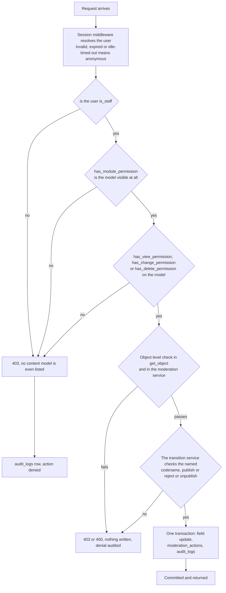

# Roles and permissions

- **Status:** Draft for review
- **Date:** 2026-10-03
- **Relates to:** brief §9 (admin security, RBAC with least privilege verified server-side);
  ADR 0005 (Django admin, sessions, no JWT), ADR 0009 (Django auth groups);
  `docs/01-requisitos/srs.md` §2.2, §3.4 (FR-D-01 … FR-D-14), §5 (SEC-01 … SEC-16);
  `docs/02-diseno/modelo-datos.md` §5; `docs/02-diseno/autenticacion.md`;
  `docs/02-diseno/estados.md`; `docs/03-pruebas/casos-seguridad.md` (SEC-13 … SEC-17)
- **Implementation:** Django `auth_group` + `ModelBackend`, custom `Meta.permissions` on the
  moderation models, a shared moderation service, DRF permission classes, Django admin
  permission hooks

## 1. The model

Three Django auth groups, named by SRS §2.2 and FR-D-02:

| Group | Human name | Authentication | One-line scope |
|---|---|---|---|
| `admin` | Administrator | Session + TOTP, mandatory | Configuration, users, legal versions, ingestion runs — and everything `editor` may do |
| `editor` | Editor | Session, TOTP optional | Content moderation only |
| `viewer` | Viewer | Session, optional TOTP | Read-only |

Three properties make the matrix enforceable rather than decorative:

1. **Groups are created by a data migration, not by hand.** `manage.py seed_roles` (name
   **undecided**) assigns an explicit permission set per group, so the set is reviewable,
   reproducible, and identical in every environment.
2. **Moderation permissions are custom codenames**, declared in `Meta.permissions` of the
   moderation models: `publish_<model>`, `reject_<model>`, `unpublish_<model>`,
   `request_changes_<model>`. The generic `change_<model>` permission controls **field
   editing** and deliberately does **not** grant publication. Conflating the two would make
   "can edit" and "can publish" the same question, and would break the moment someone wanted
   an editor who could correct copy but not publish it.
3. **Every capability in §3 maps to exactly one check.** No capability is enforced in two
   places with different answers.

## 2. Role definitions

### `admin`

**Responsibilities.** Approve, reject, unpublish; configure the site (`site_settings`); create,
edit, disable and re-enable `scrape_sources`; trigger ingestion runs; manage
`legal_documents` versions; manage users, groups and group membership; respond to takedown
requests and purge the PII after the retention deadline; revoke all sessions of an account;
purge rejected uploads and expired raw payloads.

**Must not be able to.** Modify or delete an `audit_logs` row (FR-D-09, SEC-16); publish an
asset whose `rights_status` is `unknown` (LEG-02); publish an image of a minor without
guardian authorisation (LEG-09); close an `illegal_content` takedown with an internal note
(FR-G-05); create an account through any public path (FR-D-13); edit a published legal
document in place (FR-G-02).

### `editor`

**Responsibilities.** Work the review queue: view pending items, approve, reject with a reason,
request changes, unpublish, edit content fields while a record is pending; inspect the source
URL and raw payload behind a pending scraped record (FR-C-09); trigger an ingestion run for a
single source (FR-B-18); respond to takedown requests (SRS §2.2); view source status and run
history.

**Must not be able to.** Change site configuration, create or edit a `scrape_source`, manage
users or roles, edit legal document versions, view the audit log, purge rejected uploads or raw
payloads, delete a takedown request, or force a run across all sources (FR-D-06, FR-D-07).

### `viewer`

**Responsibilities.** Read the admin and the data: the review queue, ingestion runs, source
status, content.

**Must not be able to.** Transition moderation state in **any** direction, edit any field,
delete anything, see the raw third-party payload behind a pending record, see the audit log,
or see any PII. A `viewer` is a diagnostic role, not a probationary `editor` (FR-D-05,
SEC-13).

## 3. Permission matrix

`allow` = permitted and enforced by the named mechanism. `deny` = refused server-side with
`403` (or an equivalent refusal) and, where a write was attempted, an `audit_logs` row.

| # | Capability | Mechanism (Django permission or hook) | admin | editor | viewer |
|---|---|---|---|---|---|
| 1 | Read the public site and the published-only API | `AllowAny` + queryset filtered to `status='published'` (FR-A-06, NFR-18, SEC-47) | allow | allow | allow |
| 2 | Submit a public submission (v3) | `AllowAny` + CAPTCHA, honeypot (SEC-27), per-IP and daily pending quota (SEC-22), duplicate hash refused (SEC-23) | allow | allow | allow |
| 3 | View pending and rejected items in the admin | `view_<model>` on `events`, `news_items`, `media_assets`, `submissions` | allow | allow | allow |
| 4 | **Approve** `pending → published` | custom `publish_<model>` in `Meta.permissions`, checked in the shared moderation service and in the admin action (FR-C-03, SEC-17) | allow | allow | **deny** (FR-D-05) |
| 5 | **Reject with a reason** | custom `reject_<model>`; `rejection_reason` NOT NULL + `CHECK` (FR-C-04, SEC-17) | allow | allow | **deny** |
| 6 | **Unpublish** `published → pending` | custom `unpublish_<model>`; deliberate action only (FR-C-05) | allow | allow | **deny** |
| 7 | Request changes (`pending → pending`) | custom `request_changes_<model>`; writes `moderation_actions`, leaves `status` pending | allow | allow | **deny** |
| 8 | Edit content fields of a `pending` record | `change_<model>` plus the object's own state checks | allow | allow | **deny** |
| 9 | Edit content fields of a `published` record | read-only on published rows; changes only via the reviewed proposal path — **undecided**, `flujo-datos.md` §5.1 | allow | allow | **deny** |
| 10 | Hard-delete a rejected upload | admin action restricted to `status='rejected'`; `has_delete_permission` override (the only hard delete permitted, `modelo-datos.md` §1) | allow | **deny** | **deny** |
| 11 | View the source URL and raw payload behind a pending record | `view_rawdocument` + short-lived signed URL to the quarantine bucket (FR-C-09) | allow | allow | **deny** — third-party material, LEG-05 |
| 12 | Create or edit content by hand (`origin = manual`) | `add_<model>` / `change_<model>`; `created_by` is forced to the session user | allow | allow | **deny** |
| 13 | Edit `site_settings` | `change_sitesetting` (FR-D-07); every change also written to `audit_logs` | allow | **deny** | **deny** |
| 14 | Publish or withhold an `editions` row as a unit | `change_edition` + `is_published` guard (FR-A-10) | allow | **deny** | **deny** |
| 15 | View `scrape_sources` status | `view_scrapesource` (FR-D-12: active flag, consecutive failures, last successful run) | allow | allow | allow |
| 16 | Create, edit or disable a source (URL, selectors, cron, rate limit) | `add_/change_/delete_scrape_source` (FR-D-07) | allow | **deny** | **deny** |
| 17 | Trigger an ingestion run for **one** source | admin action and management command scoped to a single source (FR-B-18, Should/MVP) | allow | allow | **deny** |
| 18 | Trigger a run across **all** sources, or force-retry a breaker-disabled source | re-enabling a source is "managing" it (FR-D-07) | allow | **deny** | **deny** |
| 19 | View `ingestion_runs` | `view_ingestionrun` | allow | allow | allow |
| 20 | Re-enable a source the breaker disabled | `change_scrape_source` behind an explicit "manual re-enable" action that records `last_error` in `audit_logs` | allow | **deny** | **deny** |
| 21 | Purge `raw_documents` beyond the retention limit | `delete_rawdocument` (FR-B-16) | allow | **deny** | **deny** |
| 22 | View `audit_logs` | `view_auditlog`; the list view filters `changes` for non-admins | allow | **deny** | **deny** |
| 23 | **Update or delete an `audit_logs` row** | no group holds `change_auditlog` or `delete_auditlog`; the table is not registered in the admin as editable; a PostgreSQL `BEFORE UPDATE OR DELETE` trigger raises (FR-D-09, SEC-16) | **deny** | **deny** | **deny** |
| 24 | Create a new `legal_documents` version | `add_legaldocument` (FR-G-01) | allow | **deny** | **deny** |
| 25 | Edit an already-published legal version | `ModelAdmin.has_change_permission` returns `False` once a version has been current (FR-G-02) | **deny** | **deny** | **deny** |
| 26 | Respond to a takedown request (`status`, `action_taken`, `responded_at`, escalate) | `change_takedownrequest` (FR-G-04 … FR-G-06, SRS §2.2) | allow | allow | **deny** (no view either: it holds `requester_email`) |
| 27 | Delete a takedown request row | `delete_takedownrequest`; recommendation is to anonymise instead of delete | allow | **deny** | **deny** |
| 28 | Purge `requester_email` after the retention deadline | `change_takedownrequest` limited to the PII field (`modelo-datos.md` §8) | allow | **deny** | **deny** |
| 29 | View users and groups | `view_user`, `view_group` | allow | **deny** | **deny** |
| 30 | Create or deactivate a user, change group membership | `add_user`, `change_user` (FR-D-07); a user may not edit their own row through the interface | allow | **deny** | **deny** |
| 31 | Edit own password and profile | Django's own account views | allow | allow | allow |
| 32 | Enrol or remove **own** TOTP device | `otp_totpdevice` owner-only views; deletion of the last device of the last active `admin` is blocked (SEC-04, SEC-05) | allow | allow | allow (own only) |
| 33 | Revoke all sessions of an account | custom `revoke_sessions` on `auth_user`; revocation is immediate and total (SEC-11) | allow | **deny** | **deny** |
| 34 | Clear another user's login throttle counters | custom `unlock_account` capability on `auth_user` | allow | **deny** | **deny** |
| 35 | Read `/health` | `AllowAny`; reports reachability only, never configuration (FR-D-11) | allow | allow | allow |

### 3.1 Cells that are decisions, and where they come from

- **Rows 4–7 are the moderation verbs.** FR-D-05 makes row 4–7 a hard `deny` for `viewer`.
  SRS §2.2 and FR-C-05 place unpublish with the `editor`, so row 6 is `allow` for `editor`
  and not admin-only: pulling live content on a rights complaint must be actionable by
  whoever is reviewing it. The decision is deliberate, fully audited, and reversible.
- **Row 17 versus row 18.** FR-B-18 (Should) lets an `editor` run the pipeline for a single
  source. FR-D-07 reserves "manage scrape sources" to `admin`. The boundary drawn here:
  *executing* a run for one source is an `editor` action; *changing or re-enabling a source*,
  and running everything at once, is configuration and stays with `admin`. SRS §2.2 lists
  "ingestion runs" under the administrator; the conflict with FR-B-18 is recorded here
  rather than silently resolved, as SRS §10 requires.
- **Row 11.** FR-C-09 requires the reviewer to see the raw payload, so `editor` has access.
  `viewer` does not: the payload is third-party material that LEG-05 and ADR 0004 keep out
  of the repository and out of unlicensed circulation, and a read-only role has no need of it.
- **Row 26.** SRS §2.2 gives `editor` the ability to respond to takedowns, so `editor` may
  change a request. `viewer` may not even see one, because the row carries
  `requester_email` — PII (PRV-03).
- **Row 9 is genuinely open.** The data model has no mechanism for proposing a change to live
  content (`flujo-datos.md` §5.1, open item 1). Until it is decided, content fields on a
  `published` row should be read-only in the form for every role, so that no path exists for
  an unreviewed edit to public content.
- **Row 23 is not a permission at all.** See §5.

## 4. Least privilege, per brief §9

Brief §9 requires RBAC with least privilege, verified always on the server. Applied:

- **`viewer` is read-only and can never transition moderation state.** It holds `view_*` and
  nothing else. It cannot approve, reject, unpublish, request changes, edit, or delete
  (FR-D-05). A `viewer` that could approve "just this once" would be an `editor` with worse
  audit expectations, so the deny is structural, not procedural.
- **`editor` can approve and reject content, and nothing that changes how the system
  behaves.** It cannot change site configuration, manage users or roles, or edit legal
  documents (FR-D-06, and row 13/24/25/29/30). An editor who could edit the legal text would
  be able to alter the terms a contributor is held to, which is a conflict of interest
  regardless of intent.
- **`admin` is the only role** that manages users, roles, site settings, scrape sources and
  legal document versions (FR-D-07).
- **No role, `admin` included, can modify or delete an `audit_logs` entry** (FR-D-09). An
  accountability record that the most powerful role can rewrite is not an accountability
  record. Append-only is enforced at the database and the application level (SEC-16).
- **Deny by default.** A capability that is not in this matrix is refused. SEC-13 asserts
  exactly that, in both directions: every listed cell is enforced, and no unlisted capability
  is reachable by any role.
- **The seed administrator should not be a superuser.** `is_superuser` bypasses every check
  in this document, which would make the matrix decorative for the one account that matters
  most. **Proposed default:** a staff user in the `admin` group with an explicit permission
  set. If the usability cost turns out to be too high, a superuser is acceptable but must be
  recorded as a deliberate deviation, and SEC-13 must exclude superusers from the
  cell-by-cell run.

## 5. Enforcement points

All of them are server-side. Four layers, in the order a request meets them:

| Layer | Mechanism | Enforces |
|---|---|---|
| 1 | **Django model permissions** — auto-created `add_/change_/delete/view_<model>` plus the custom `Meta.permissions` codenames, evaluated by `ModelBackend.has_perm` | Which model, and which verb. `change_<model>` never implies publication |
| 2 | **Explicit object-level checks** in a DRF permission class and in the shared moderation service, called from `get_object` | SEC-14 (object level), SEC-15 (an anonymous caller reaches nothing). The object is re-checked against its own state: `status`, `rights_status != unknown`, `exif_stripped`, and `minor_subject → guardian_consent_on_file` (LEG-02, LEG-09) |
| 3 | **Django admin hooks** — `has_module_permission`, `has_view_permission`, `has_change_permission`, `has_delete_permission`, `get_queryset`, `get_readonly_fields`, `get_fieldsets` | The console. `get_queryset` means a denied model is invisible, not merely uneditable; `has_delete_permission` is overridden to allow deletion only on rejected uploads |
| 4 | **The database** — `CHECK` constraints (`status='rejected' → rejection_reason`), `NOT NULL` on FKs, and the append-only trigger on `audit_logs` | The invariant even when the application is bypassed (SEC-30, SEC-31, SEC-16) |

**Hiding a control in the interface is never the control** (FR-D-04). A button that is not
rendered for a `viewer` is a courtesy; the `403` in the diagram is the enforcement. The same
applies to a disabled field, a filtered list, and a React-side conditional.

**`audit_logs` append-only, three ways.** No group holds `change_auditlog` or
`delete_auditlog`, so no admin interface or ORM path can alter it; the model is not
registered as editable in the admin; and a PostgreSQL `BEFORE UPDATE OR DELETE` trigger
raises, which only the table owner can disable. The application-level check alone is not
sufficient against a direct database connection (SEC-16, which tests all three routes).

**Object-level, not only list-level.** SEC-09 and SEC-14 require that reaching a record by
direct URL or primary key is refused, not only that it is absent from a list. Note a gap:
SEC-14's precondition assumes content assigned to a particular editor, and the data model
has no assignment field. The object-level checks that do exist here are the object's own
state (status, rights, publication) and the exact permission codename for the verb. **The
matrix in §3 is the authority**; if per-editor assignment is ever added, `get_object` must
gain an ownership check and SEC-14 becomes applicable as written.

## 6. A fresh install exposes nothing

FR-D-03: Django admin ships with full permissions, so the console must be effectively
unusable until roles are configured — it must not expose unreviewed `pending` content by
default. The mechanism has four parts:

1. **No user is created by a migration.** `migrate` creates the three groups and their
   permission sets and nothing else. Accounts come only from the seed command or Django's
   `createsuperuser` (FR-D-13, FR-D-14, SEC-12).
2. **Django admin requires `is_staff`.** Nobody is staff until the seed command says so, so a
   fresh deployment has no reachable console at all.
3. **A system check fails the build** when the permission set is inconsistent — a group
   holding `publish_*` without being `admin` or `editor`, or a `viewer` holding any
   `change_*` or `delete_*`. `manage.py check` runs in CI (NFR-11).
4. **Pending content is invisible by construction.** The pipeline's only writes to content
   tables are `pending` inserts, and the public API filters to `published` (FR-A-06,
   SEC-47), so an unreviewed record cannot surface even if the console were open.

## 7. The public API has no authenticated surface

- The public API is `AllowAny`, read-only, and filtered to `published` (NFR-18, FR-A-06).
- The only anonymous write is the submission endpoint, and only from v3 (NFR-18, SEC-15).
- There is **no user registration, no login endpoint, and no third-party client**, so no
  token scheme exists anywhere. **The only authenticated human surface in this project is
  Django admin** (`autenticacion.md` §13).
- **Testable consequence:** the generated OpenAPI contract must contain no
  `securitySchemes` and no operation-level `security`. Because the contract is generated and
  CI fails on drift (ADR 0011, NFR-12), an accidentally authenticated endpoint would break the
  build rather than ship quietly. This is the cheapest possible guard against reintroducing
  the token model the brief specified.

## 8. Open items

| # | Item | Status | Proposed default |
|---|---|---|---|
| 1 | Mechanism for editing a `published` record (matrix row 9) | **undecided** — `flujo-datos.md` §5.1 open item 1 | Content fields read-only on published rows until the reviewed proposal path exists |
| 2 | Boundary between a single-source run and a full run (rows 17–18), and the conflict with SRS §2.2 | **undecided**, recorded per SRS §10 | `editor` runs one source; `admin` runs everything and re-enables sources |
| 3 | Whether the seed administrator is a superuser (§4) | **undecided** | No. A staff user in the `admin` group with explicit permissions |
| 4 | Whether `editor` may purge `requester_email` after the retention deadline (row 28) | **undecided** | No — PII purge is an `admin` act, recorded in `audit_logs` |
| 5 | Whether `takedown_requests` rows may ever be deleted (row 27) | **undecided** | Prefer anonymisation over deletion; the row is legal correspondence |
| 6 | Object ownership for SEC-14 (§5) | **undecided** | No assignment field in the model; add one only if a second moderator appears |
| 7 | Management command names (`seed_roles`, `seed_admin`, `create_staff`, `unlock_account`) | **undecided** | As named in `autenticacion.md` §12 |
| 8 | Raw-payload signed-URL lifetime for reviewers | **undecided** | Short-lived, issued on demand, never stored in a table |

## 9. References

- Brief §9 — Argon2id, TOTP for administrators, server-side RBAC with least privilege, audit
  of every approval, rejection and configuration change, no public admin sign-up.
- ADR 0005 — Django admin is the console; sessions, TOTP, no JWT; central revocation.
- ADR 0009 — Django auth groups, `audit_logs` written from signals.
- ADR 0011 — generated OpenAPI contract, CI drift check.
- `docs/01-requisitos/srs.md` §2.2 (user classes), §3.4 (FR-D-01 … FR-D-14), §5 (SEC-01 … SEC-16),
  §6 (PRV-01 … PRV-09), §7 (LEG-01 … LEG-10), §10 (conflicts are recorded, not resolved).
- `docs/03-pruebas/casos-seguridad.md` — SEC-13 (matrix enforced cell by cell), SEC-14
  (object level), SEC-15 (anonymous callers), SEC-16 and SEC-50 (append-only audit), SEC-17
  (every moderation action recorded), SEC-04/05 (TOTP), SEC-11 (central revocation), SEC-22,
  SEC-23, SEC-27 (submission quotas and anti-automation), SEC-30/31 (rights gates bypass
  nothing), SEC-47 (published only).
- `docs/02-diseno/modelo-datos.md` §5 (`auth_user`, `auth_group`, `django_session`, `audit_logs`).
- `docs/02-diseno/estados.md` — the transitions each verb performs.
- `docs/02-diseno/autenticacion.md` — sessions, MFA, throttling, provisioning.
- `docs/01-requisitos/matriz-trazabilidad.md` — every capability above maps to a requirement
  row and a verification method.